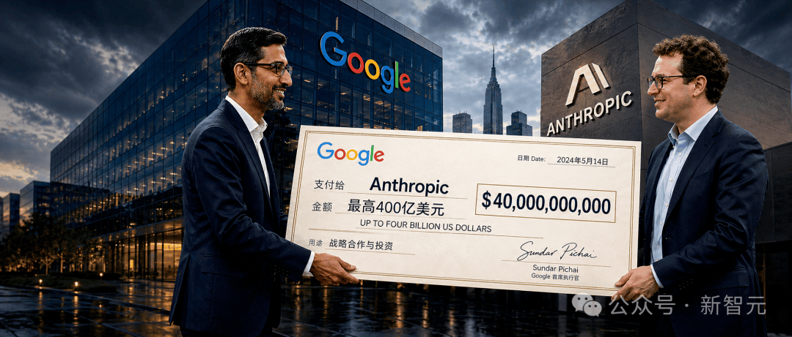
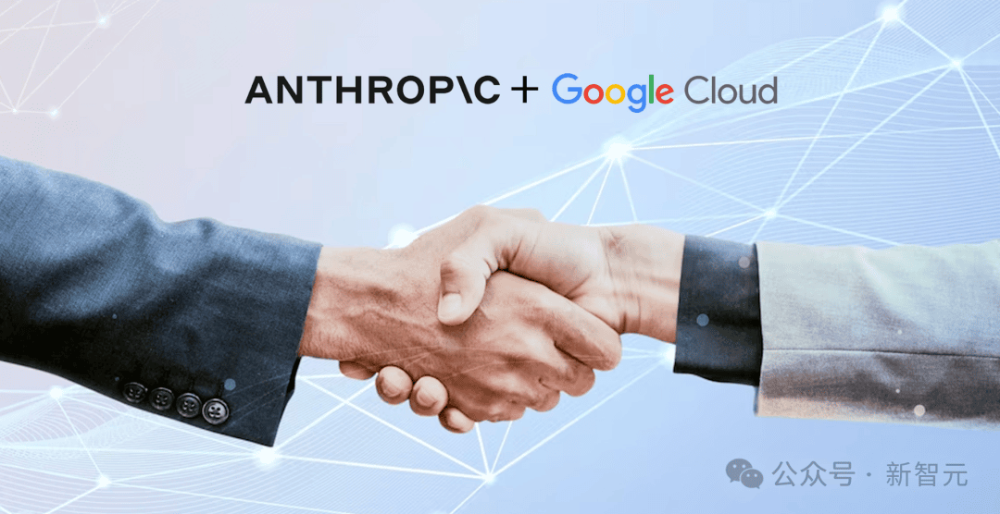
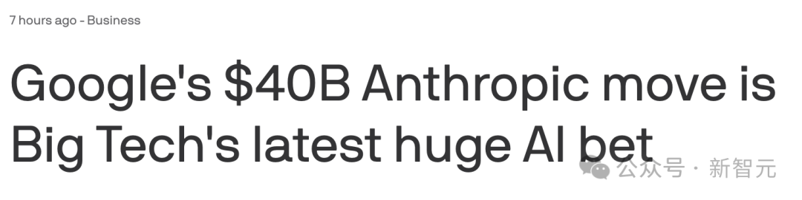
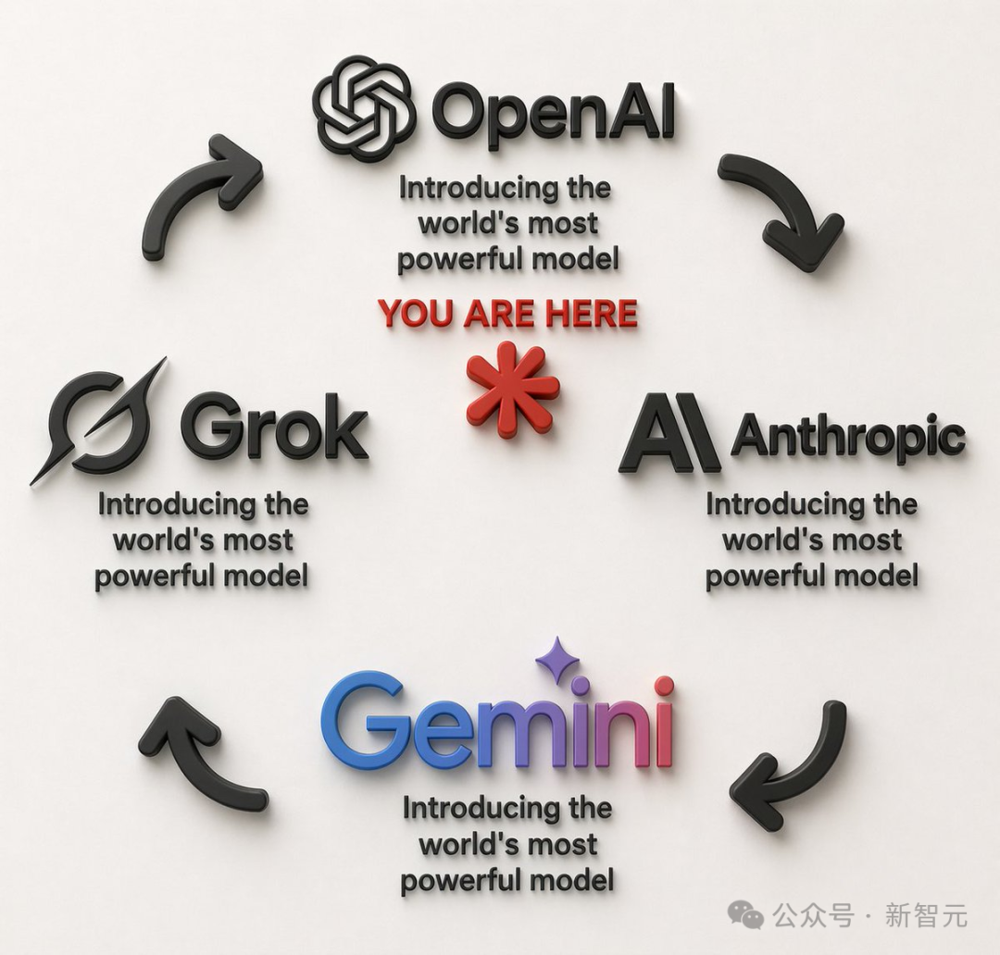

# 2026/04/25 · 谷歌向最大竞争对手砸 400 亿，AI「御三家」时代宣告终结

> 预计阅读时间：9 分钟 · 约 2900 字

---

## 一、今天发生了什么

2026 年 4 月 25 日，谷歌宣布将向 **Anthropic** 投资最高 **400 亿美元**。

- 100 亿美元立即到账，按 Anthropic 3800 亿美元的最新估值入股
- 剩余 300 亿美元绑定业绩里程碑，Anthropic 达到目标即可到账
- 谷歌云同时承诺，未来五年向 Anthropic 提供 **5GW** 算力（关于这个单位是什么意思，下面会解释）

Anthropic 是做 Claude 的公司。Claude 是目前在企业市场和开发者社区里最受欢迎的 AI 工具之一，和谷歌自家的 Gemini 是直接竞争对手。

一家公司，往死对手身上砸 400 亿。

谷歌宣布投资 Anthropic 的主视觉。这是 AI 史上单笔金额最大的战略投资之一。（图源：[新智元](https://mp.weixin.qq.com/s/mUDP1t3yVSwaPZg9SzdgGg)）

---

## 二、什么是「御三家」，为什么这个说法要结束了

过去两年，如果你在 AI 圈混，一定听说过一个词：**御三家**。

这是个从动漫文化借来的说法，指的是 AI 第一梯队里三足鼎立的三家公司：

- **OpenAI**：做 GPT 和 ChatGPT，背后站着微软
- **谷歌**：做 Gemini，有自己的芯片（TPU）和云服务
- **Anthropic**：做 Claude，最初同时接受亚马逊和谷歌的投资，但保持独立姿态

三家各有金主，互相竞争，这个格局维持了大约两年。

直到 2026 年 4 月的这一周，局面变了。

把 Anthropic 过去半年收到的投资清单列出来：

| 投资方 | 承诺金额上限 | 另附算力承诺 |
|--------|------------|------------|
| 亚马逊 | 250 亿美元 | 5GW Trainium 芯片 |
| 谷歌 | 400 亿美元 | 5GW TPU 芯片 |
| 英伟达 | 100 亿美元 | 1GW GPU |
| 微软 | 50 亿美元 | Azure 云算力 |

亚马逊、谷歌、英伟达、微软——这四家公司，是当今全球最重要的科技基础设施提供商，全部在同一家 AI 公司的股东名册上。

其中最戏剧性的是微软：它同时是 OpenAI 的最大外部投资方，转头又给 OpenAI 的死对头投了钱。这在商业上叫「两头下注」，但从 OpenAI 的角度看，就有点尴尬了。

格局从「三家分天下」，变成了「**Anthropic vs OpenAI**」两强对垒。御三家，作古了。

Anthropic 获得的算力承诺总量：亚马逊 5GW + 谷歌 5GW + 英伟达 1GW，合计超过 11GW，相当于 10 个核电站的发电量。（图源：[新智元](https://mp.weixin.qq.com/s/mUDP1t3yVSwaPZg9SzdgGg)）

---

## 三、谷歌为什么要这么做

理解谷歌的决定，要看三个数字。

**第一个：30 倍**

Anthropic 的年化收入（可以理解为「把当前月收入乘以 12 估算全年规模」），从 2025 年初的 10 亿美元，在一年内涨到了 2026 年 3 月的 300 亿美元。一年，30 倍。

Claude Code（一个帮程序员写代码的工具）在程序员圈子里爆火，企业端从创业公司到财富 500 强都在用。Gemini 做了两年，在同样的市场里一直被 Claude 压着。

**第二个：1 万亿美元**

Anthropic 在二级市场（还没上市，但股份已经在私人市场流通）的隐含估值，已经飙到了 1 万亿美元，比 OpenAI 的 AI 业务估值还高。

谷歌如果现在入股，等于在一个确定性很高的标的上早早锁定了位置。

**第三个：1850 亿美元**

这是谷歌今年的资本开支计划。大部分要砸在数据中心、自研芯片（TPU）生产和电力基础设施上。

问题是，芯片生产出来要有人用。Anthropic 是全球消耗 TPU 最多的公司之一。谷歌投资 Anthropic，等于同时锁定了一个稳定的大客户——自己生产的芯片，Anthropic 来买单。

把这三点放在一起：谷歌的这笔投资，是一个「输不起就买进来」的对冲操作。如果 Claude 赢了，谷歌有股权收益；如果 Gemini 赢了，谷歌两头都赚；如果 Gemini 没赢，至少 TPU 出货稳了。

---

## 四、「算力」是什么，为什么它变成了最重要的事

这整件事的底层逻辑，是**算力**。

**算力**，简单理解就是让 AI 运行起来所需要的计算资源，主要由专用芯片（GPU、TPU 等）和数据中心构成。训练一个更聪明的模型、让更多用户同时使用 AI，都需要消耗大量算力。

之前，算力是一种成本，贵，但能买到。现在，它变成了一种战略资源——不是你有钱就能随时拿到的。

Anthropic 在这次融资公告里直接说了：公司的用户增速太快，**基础设施快撑不住了**。一旦算力不够，服务质量就会下降，用户就流失。所以这一周的核心，不只是融资，而是锁定算力。

亚马逊 5GW + 谷歌 5GW + 英伟达 1GW，合计超过 **11GW**。

「GW」是千兆瓦，是衡量数据中心电力规模的单位，1GW 大约相当于一座大型核电机组满负荷发电量。11GW 相当于 10 个核电站。

与此对比，OpenAI 宣布的 Stargate 项目，目标也是 10GW——但这个项目的落地周期是「未来数年」，核心数据中心到 2026 年 4 月建设进度依然缓慢，预计要到 2029 年才能全面达产。

Anthropic 用一周锁定了等量级的算力，OpenAI 做同样的事要等三年以上。

AI 行业的新护城河：谁先锁住算力，谁就有底气推下一代模型。（图源：[新智元](https://mp.weixin.qq.com/s/mUDP1t3yVSwaPZg9SzdgGg)）

---

## 五、OpenAI 现在处境怎么样

OpenAI 不是完全没有资金来源。软银、英伟达（另行承诺）、Oracle，还有一些中东主权基金都在。但这些钱大多数要通过 Stargate 这个落地不确定的载体才能到位。

更深层的问题是：**OpenAI 的竞争优势在收窄**。

GPT-5.5 在各项测试中单点性能依然领先，但 Claude Code 在程序员市场的渗透率已经碾压 Gemini 同类产品，Claude 在企业级应用里的份额也在持续扩大。奥特曼最近提出 OpenAI 要转向「AI 操作系统」方向——但要做成操作系统，需要的是开发者生态和基础设施的绑定，而这两项恰恰是 Anthropic 阵营刚刚完成的事。

OpenAI 仍有多个算力来源，但分散、落地慢，形成鲜明对比。（图源：[新智元](https://mp.weixin.qq.com/s/mUDP1t3yVSwaPZg9SzdgGg)）

---

## 六、这件事和我有什么关系

如果你只是普通用户，短期内感受不到太大变化。Claude 还是 Claude，ChatGPT 还是 ChatGPT，你用哪个趁手用哪个就好。

但有几件事值得放在脑子里：

**AI 竞争的逻辑变了**。过去两年，大家评价 AI 好不好，主要看「跑分」——谁在某个测试集上准确率更高。但这个阶段正在过去。接下来决定胜负的，是谁的服务更稳定、谁的生态更完整、谁的算力够撑住下一代模型。

**工具的稳定性会越来越重要**。Anthropic 拿到算力保障后，Claude 的服务质量和响应速度应该会改善。如果你或你的团队在用 Claude，这是个好消息。

**AI 行业的「排名」会频繁变动**。今天 Anthropic 的估值压过了 OpenAI。上个月 DeepSeek 开源版的能力逼近闭源旗舰。这个行业的格局每季度都在调，没有谁的位置是永久锁定的。

---

## 扩展阅读

本文参考了以下原作者的文章（推荐读原文）：

- [谷歌跪了？400亿砸向死敌！AI御三家终结，OpenAI孤立无援](https://mp.weixin.qq.com/s/mUDP1t3yVSwaPZg9SzdgGg) · 新智元（微信公众号）
