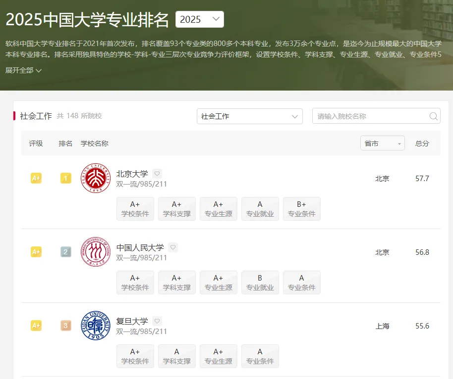
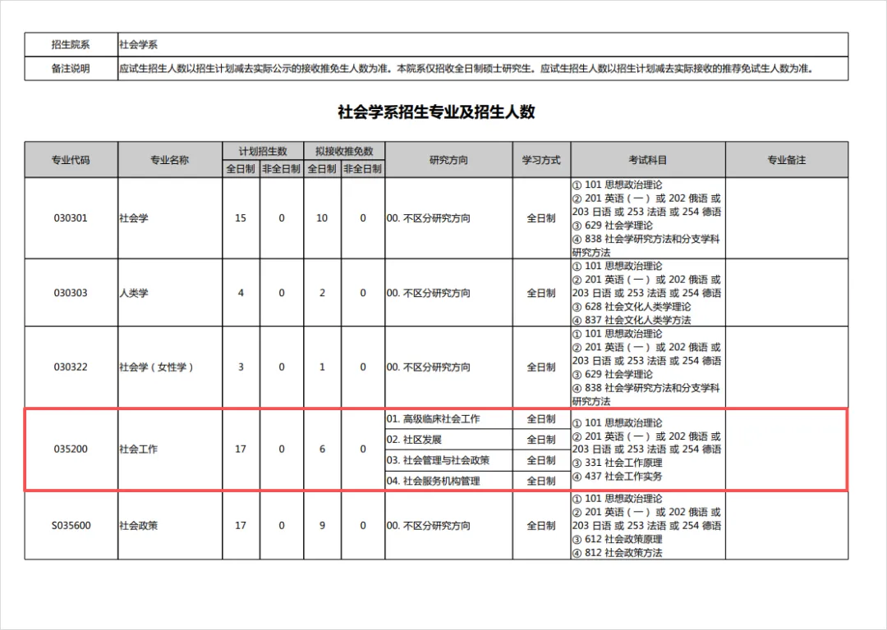

# 2026/04/27 · 她没有订阅 ChatGPT，用免费 AI 从二本考上了北大

## 一、今天的故事

陈雨欣，21 岁，安徽人，网络与新媒体专业，毕业于一所大多数人没有听说过的二本院校。

今年，她考上了北京大学社会工作专业的硕士研究生。

北大社会工作，在软科中国大学专业排名里是全国第一。今年统考只招 11 人，北大在北京自主划线，阅卷压分出了名。

她身边没有一个考过这个方向的学长学姐。她们学校甚至没有开设社会工作这个专业。同学们不知道她在备考研究生，父母不了解她的学习细节。

一个人，坐在桌前，从头啃。

整个备考期间，她没有订阅过 ChatGPT，没有用过 Claude。原因很朴素：「免费的为什么不用，为什么要付费？」

软科2025中国大学专业排名，社会工作方向共148所院校参评，北京大学位列第一（总分57.7）。这也是陈雨欣选定这个方向的背景之一。（图源：[数字生命卡兹克](https://mp.weixin.qq.com/s/0v-Yn5p02nzMjw5Z8-Enlw)）

北大社会学系2026年硕士招生计划表：社会工作专业（代码035200）全日制计划招17人，其中6个推免名额，留给统考的只有11个。（图源：[数字生命卡兹克](https://mp.weixin.qq.com/s/0v-Yn5p02nzMjw5Z8-Enlw)）

---

## 二、大多数人用 AI 的方式，她反着来

如果你观察周围人怎么用 AI，会发现一个常见模式：把任务整个丢给 AI，让它帮你读完这本书、整理一套笔记、输出一篇总结。恨不得 AI 把所有事都干了。

陈雨欣的用法正好相反。

她有一条自己的规则：**只有在「卡点」出现的时候，才打开 DeepSeek**。

所谓卡点，就是某个概念反复读就是绕不明白，或者想写一段论述但脑子里一个例子都想不出来。只有这时候，她才开 AI。让它把那些宏大的理论和生活里的具体小事连在一起，帮她打通认知。

用了 AI，读通了，然后继续自己啃书。

她前后写了将近 30 万字，每一个字都是自己敲的。

去年五月，她在小红书上看到上届北大社工考研第一名的学姐推荐了一款叫 Chatbox 的工具（当时免费可用），从这里正式开始接触 AI 辅助学习。后来主力转为 DeepSeek，豆包用来生成图片和做模拟面试，讯飞星火偶尔用来生成论文框架。

国内免费工具，全套。

---

## 三、一个她自己琢磨出来的技巧

用了一段时间 AI 之后，陈雨欣发现一个问题：直接甩一个问题过去，得到的回答经常是散的、发散的、不够聚焦。

她没有去找攻略，自己摸索出了一个方法：**给 AI 设定一个专业身份**。

初试备考阶段，她让 AI 扮演「北京大学社会工作专业研究生老师」来回答问题。复试阶段，她让 AI 扮演「面试官」来问她问题。

这在 AI 圈子里有个名字，叫「角色提示」。但她不知道这个词，也没从教程里学过，是自己用着用着悟出来的——觉得给一个身份，AI 给的东西就更精准了。

---

## 四、到了冲刺阶段，她把 AI 完全关掉

进入冲刺备考的后期，陈雨欣做了一件很多人觉得反常的事：**停止使用 AI，进入完全闭卷模式**。

不看书，不看笔记，也不开 AI，对着空白试卷限时模拟考试。做了大量这样的练习。

写完之后，她才重新打开 DeepSeek，让它帮她检查：结构合不合理、有没有遗漏的知识点。

但 AI 能给的只是宏观方向。「这段论述够不够专业」「这个地方理解有没有偏」——这类深度判断，AI 判断不了。于是她在小红书上找了一位南京大学社工专业毕业几年的学长，付费让他来逐字批改。

**最终版本 = AI 批改宏观结构 + 学长批改专业深度 + 自己的思考**。

她的解释很直接：「我怕 AI 的思路替代了我自己的思路。怕我在考场上写出来的东西，不是我自己想的。」

---

## 五、一个容易被忽视的问题：经济差

采访这篇文章的作者卡兹克，在文章后半段写了一段让很多人停下来想的话。

他说，我们经常站在一个很高的位置去看所有人，觉得「你怎么还用这么基础的工具」「你怎么不试试这个那个」。但我们忘了，对很多人来说，那个门槛根本不是技术门槛，而是经济门槛。

ChatGPT 付费版每月 20 美元，大约 140 元人民币。

对大多数已经在工作的人，这是一杯咖啡的价格。但对一个每月生活费只有千把块、勤工俭学、还要自己买书和备考资料的学生，每个月 140 元订阅一个 AI 工具，根本不在选项里。

「我们总说 AI 是这个时代最伟大的平等器，免费的大模型到处都是。但你仔细想想，真的平等吗？最好的模型不是免费的，最好的工具不是免费的。围绕这些工具的信息生态和圈子，在很多时候，它都不是免费的。」

陈雨欣的成功，是她自己的能力、努力和韧性的胜利。不是 AI 时代信息差消失的证明。

---

## 六、这件事对我们有什么启发

这个故事里有几件事值得放在脑子里。

**用 AI 最容易犯的错，是用它替代思考。** 陈雨欣最值得学习的地方，不是她用了什么工具，而是她对「什么时候用、什么时候不用」有清晰的边界感。AI 帮她打通卡点，但主动阅读、主动练习、主动整理思路，始终是她自己在做的。

**免费工具完全可以达到专业效果。** DeepSeek、豆包，国内这几款产品的能力已经足够支撑严肃的学习任务。如果你现在还没开始用 AI，不需要等到「先搞定订阅」——从免费的开始就够了。

**AI 能批改结构，但判断不了深度。** 陈雨欣把宏观批改交给 AI、深度批改交给真人专家，这个分工值得借鉴。AI 最擅长的是结构、覆盖度、逻辑连贯性；专业判断、语气是否合适、哪里理解出了偏差，这些还是要靠人。

最后是卡兹克引用的那句话，陈雨欣从备考时就写在本子上的荣格的话：

> I am not what happened to me, I am what I choose to become.
>
> 我不是我所经历的一切。我是我选择成为的那个人。

---

## 扩展阅读

本文参考了以下原作者的文章（推荐读原文）：

- 《一个二本的女生，用免费的AI考上了北大。》 · **数字生命卡兹克**（微信公众号）· [原文链接](https://mp.weixin.qq.com/s/0v-Yn5p02nzMjw5Z8-Enlw)
