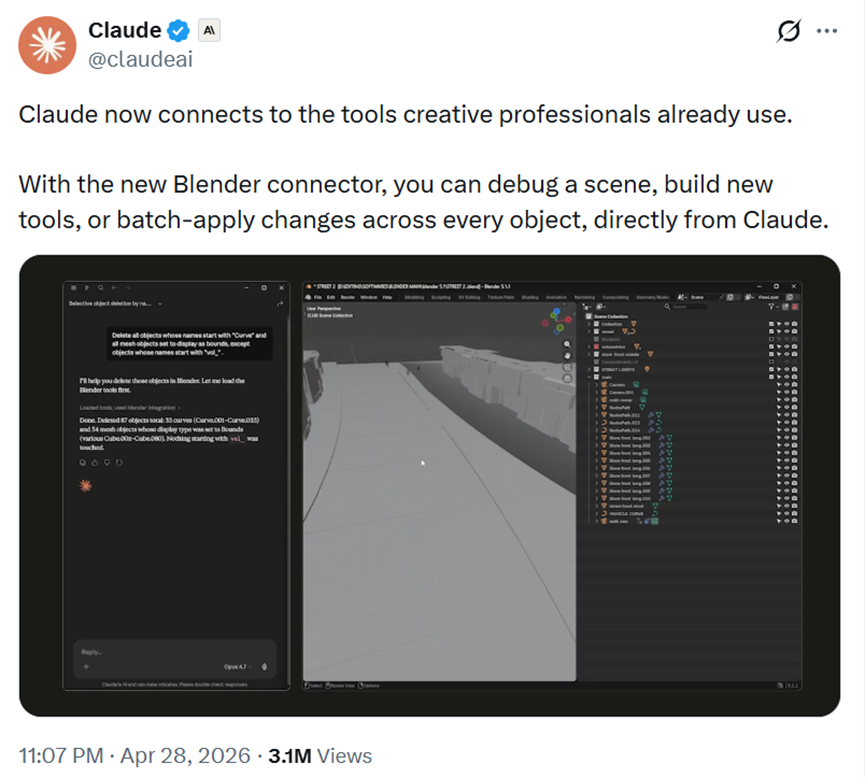
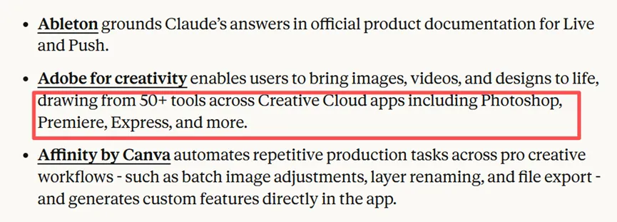
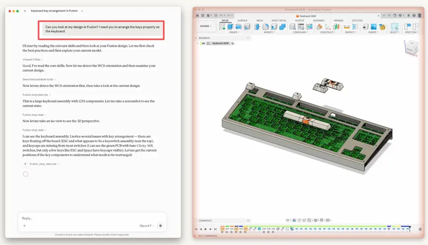

# 2026/04/29 · Claude 正式进驻设计师、音乐人、3D 建模师的工具软件

## 一、发生了什么

2026 年 4 月 28 日，Claude 的开发商 Anthropic 宣布：和 8 家主流创意软件同时完成技术对接，包括 Blender、Adobe Creative Cloud、Autodesk Fusion、SketchUp、Ableton、Splice、Affinity by Canva、Resolume。

这次发布的产品叫「连接器」（Connector）。所谓连接器，可以理解为给 Claude 装了一双手——以前 Claude 只能坐在聊天框里和你说话，从今以后，它可以直接伸手操作这些软件。

你在 Blender 里建模时，可以用自然语言叫 Claude 帮你分析场景；你在 Ableton 里做音乐时，可以直接问 Claude 某个功能怎么用，它的回答基于官方文档，不是瞎猜；你在 Photoshop 里工作，可以让 Claude 帮你调用 Creative Cloud 里 50 多个工具。

换句话说，AI 不再只是一个可以粘贴复制的外部助手，它开始住进创意专业人士每天用的软件里了。

---

## 二、Blender：最受关注的那个

这 8 个连接器里，Blender 收到的反应最热烈。

Blender 是免费开源的 3D 制作软件，从独立游戏开发到影视制作都在用它，也是国内 3D 创作者用得最多的入门软件之一。Claude 接入后，可以用自然语言调用 Blender 的脚本接口——不只是「聊天回答问题」，而是真的能动 Blender 里的东西。

**具体能做什么？** 你建了一个复杂场景，渲染出了问题，以前得自己像大海捞针一样排查，现在 Claude 能帮你把整个场景分析一遍；你想把场景里一百个立方体同时改成圆角，它可以写一个自定义脚本，一键搞定；它甚至能直接在 Blender 界面上给你变出一个新按钮来。

Claude 官方演示截图：左侧发一条自然语言指令，右侧 Blender 场景随即响应。"可以调试场景、新建工具，或者对每个物体批量应用修改——直接从 Claude 里操作。"（图源：[经管之家](https://mp.weixin.qq.com/s/2j_fMh04gEzAVhzcbLJz8w)）

专业用户的反应也印证了这一点。一位 3D 创作者说：「终于可以直接描述着色器要实现什么效果，不用再花 45 分钟对着节点编辑器独自折腾了。」另一位说：「真正的突破是它能理解整个场景、跨物体批量修改内容，再也不用花好几个小时手动清理。」

值得一提的是：Blender 的连接器不只 Claude 能用，其他 AI 模型也可以接，这符合 Blender 一贯的开源精神。Anthropic 同步宣布加入 Blender 开发基金，成为赞助方，说明这不是一次性合作，而是长期押注这套底层接口。

---

## 三、Adobe：从竞争对手到合作方

这次 Adobe 的合作有一点背景：前段时间 Adobe 和 AI 圈有一段时间关系不太顺，Adobe 股价也跌过一次。这次两家官宣合作，算是正式握手言和。

Claude 现在可以直接调用 Photoshop、Premiere Pro、Adobe Express 等 50 多款设计软件。另外被 Canva 收购的 Affinity，以前大家做图最烦的批量改尺寸、给图层重命名这类苦力活，现在 Claude 可以直接在软件里帮你自动化搞定。

Anthropic 官方公告中的连接器列表，Adobe for creativity 一项标注：可调用包括 Photoshop、Premiere、Express 在内的 50+ Creative Cloud 工具来生成图片、视频和设计内容。（图源：[经管之家](https://mp.weixin.qq.com/s/2j_fMh04gEzAVhzcbLJz8w)）

---

## 四、Autodesk：悄悄进了建筑、制造、好莱坞的生产线

Autodesk 这个名字对普通人可能陌生，但它其实是工程和影视行业的标配软件集合：搞建筑用 Revit 和 Civil3D，做产品设计用 Fusion 和 Inventor，拍大片的特效团队用 Maya 和 3dsMax——你看的那些大片里的怪兽和爆炸场面，多半都是这俩软件做出来的。

Claude 接进来，就等于 AI 直接进入了建筑、制造、好莱坞特效这三条核心生产线。

下面这张图是实机演示：用户用一句话问 Claude 「帮我看看这个键盘设计，排列有问题」，Claude 自动读取 Autodesk Fusion 里的文件，分析出 1235 个组件的键盘装配，逐一指出哪些按键位置浮空、哪些缺少键帽，右侧同步展示 3D 模型。

实机演示：左侧 Claude 用对话分析 Autodesk Fusion 里的键盘设计，指出 ESC 键浮空、多数键帽缺失等问题；右侧 Fusion 同步展示包含 1235 个组件的 3D 键盘模型。（图源：[经管之家](https://mp.weixin.qq.com/s/2j_fMh04gEzAVhzcbLJz8w)）

---

## 五、另外 4 个工具，简单说

**SketchUp（建筑/室内设计）**：描述一个空间概念，Claude 生成初始 3D 雏形，你再拿到 SketchUp 里继续细化。

**Ableton（音乐制作）**：Claude 的回答基于官方文档，相当于给你配了一个随叫随到的专业客服，不用翻文档手册。

**Splice（音乐采样）**：Splice 有一个巨大的版权免费音效库，现在可以直接在 Claude 对话框里搜索，不用切出去找。

**Resolume（现场视觉表演）**：VJ（现场视觉表演师）可以用自然语言实时控制演出软件，不需要在演出途中手忙脚乱地点按界面。

---

## 六、Anthropic 官方是怎么定位这件事的

公告的第一句话值得读一下：

> 「Claude 无法替代创意品味和想象力，但它能打开新的工作方式。」

在「AI 会不会取代设计师/音乐人」的讨论越来越多的时候，Anthropic 在官方公告里主动划线，说得很清楚：Claude 做的事是替创意人分担低价值劳动，而不是替代创意本身。

---

## 七、对普通用户来说意味着什么

如果你是 Adobe 或 Ableton 的用户，目前这些连接器需要通过 Claude 的桌面应用来接入，具体操作方式官方还在完善，值得关注进展。

如果你不用上面任何一款专业软件，这次发布对你的直接影响不大。但它标志着一个方向的变化：AI 正在从「你切出去用一下再贴回来」的工具，变成「就住在你工作软件里的助手」。对做设计、做音乐、做 3D 的同事来说，这是个值得关注的信号。

---

## 扩展阅读

本文参考了以下原作者的文章（推荐读原文）：

- 《Claude for Creative Work》 · **Anthropic**（官方公告）· [原文链接](https://www.anthropic.com/news/claude-for-creative-work)
- 《Claude深夜炸场！接入PS、Blender、Autodesk，一句话搞定3D建模、修图》 · **经管之家**（微信公众号）· [原文链接](https://mp.weixin.qq.com/s/2j_fMh04gEzAVhzcbLJz8w)
