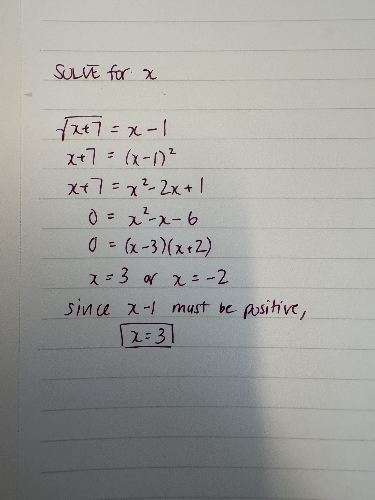
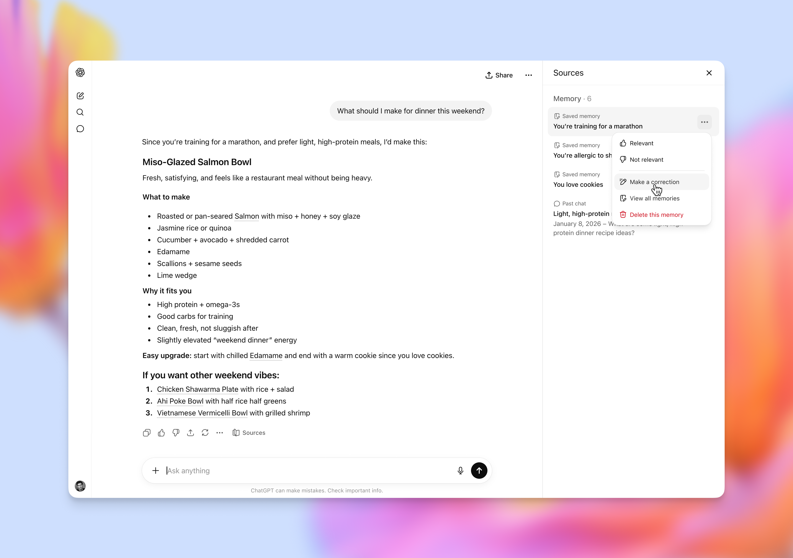

# 2026/05/06 · ChatGPT 更新默认模型，更少废话更准确

## 一、发生了什么

5 月 5 日（北京时间 5 月 6 日清晨），OpenAI 把 ChatGPT 的"默认快速模型"从 GPT-5.3 Instant 升级到了 **GPT-5.5 Instant**。

这件事乍一看像是个版本号微调，但有几点对普通用户特别重要：

- **所有用户都能用**——包括没付费的免费用户。这次升级不是 Plus 或 Pro 独享，而是从默认就给你换上更好的模型。
- **不是 GPT-5.5 Pro**——节前 OpenAI 发的"最强旗舰"GPT-5.5 Pro 是一个偏深度思考的高规格版本；这次换的是大部分人打开 ChatGPT 默认调用的那个**快速版**。
- **API 也跟进**——开发者通过 `chat-latest` 这个名字调用就直接是新版。

OpenAI CEO 奥特曼专门在推特上喊了一句话：**如果你最近只用深度思考模型了，不妨回来看看这个快速版。**

为什么默认模型的升级反而值得专门写一篇？因为它是几亿人每天在 ChatGPT 框里输入第一句话时调用的那个模型。它好一点点，世界就被多帮一点。

---

## 二、最大变化：AI 终于学会"少胡说八道了"

OpenAI 这次没像往常一样开场就堆跑分，而是把"幻觉减少"放在了第一卖点。

所谓"幻觉"，就是 AI 一本正经地编造事实——你问一个具体的法律条款、一种药的副作用、一份财报的数据，它语气自信地告诉你一个错误答案。

新的 GPT-5.5 Instant 在这件事上做得明显更克制：

- **医疗/法律/金融这类"高风险问题"上，幻觉减少了 52.5%。**
- **用户之前自己标记过"答错了"的对话，重新跑一遍，错误回答减少了 37.3%。**

为什么 OpenAI 这次先砍幻觉，不先讲跑分？

国内媒体量子位有一句话总结得特别到位：

> 模型一本正经讲错，比"不会"更麻烦。

很多人每天问 ChatGPT 的，是合同条款、报销规则、症状解释、代码报错、作业思路——这些场景里，**模型答错比答不会更具杀伤力**。所以默认模型把"答得准"放在第一位，是一次定位的转向。

在更具体的几个跑分上：

| 评测 | 测什么 | GPT-5.3 Instant | GPT-5.5 Instant |
|---|---|---|---|
| AIME 2025 | 数学竞赛 | 65.4% | **81.2%** |
| GPQA | 博士级科学推理 | 78.5% | 85.6% |
| CharXiv | 科学图表理解 | 75.0% | 81.6% |
| MMMU-Pro | 多模态专家级问题 | 69.2% | 76.0% |
| OmniDocBench | 复杂文档抽取（错误率） | 14.6% | **12.5%** |

最大的跳跃是数学竞赛 AIME 2025，从 65.4% 直接窜到 81.2%。

---

## 三、它学会了"从自己的错误里爬起来"

OpenAI 给的解释里有一个特别能说明问题的样例。

用户上传一张手写代数题的照片：解 √(x+7) = x − 1。学生算出 x = 3 或 x = −2，并因为根号必须非负排除了 x = −2。

**老版 GPT-5.3 Instant**：发现 x = 3 代回原式不成立（因为 √10 ≠ 2），就草率地宣布"原方程无解"——这其实是错的。

**新版 GPT-5.5 Instant**：同样发现 x = 3 代回不成立，但**没有就此打住**——它回头检查代数过程，定位到学生展开 (x − 1)² 时算错了一项，把方程重写成 x² − 3x − 6 = 0，再用求根公式得到正确答案 x = (3 + √33) / 2。

OpenAI 给出的代数题样例：用户上传的解题过程里有一步算错了，新旧两个模型在这一题上的处理方式截然不同。（图源：[OpenAI 官方](https://openai.com/index/gpt-5-5-instant/)）

OpenAI 自己的总结是：**"它能从最初的错误里恢复。"**

这个能力放回日常场景就是——**AI 不再只是"算错就编个理由收尾"**，而是会回头质疑自己的中间步骤。这对你让 ChatGPT 算账、查文档、改代码，都是一个明显的体感升级。

---

## 四、回答更短了

OpenAI 这次还专门做了一个老用户都会有共鸣的优化——**少说废话**。

以前问 ChatGPT 一个简单问题，它常常先来一段免责声明，再来三层嵌套列表，最后还要追问一句"你希望我继续吗"。

OpenAI 拿了一个真实的样例对比：用户问"怎么委婉告诉同事别老是叨叨没完"。

| | 旧版 GPT-5.3 Instant | 新版 GPT-5.5 Instant |
|---|---|---|
| 形式 | 5 大类方案 + 「不要做什么」清单 + 反问"你那同事是什么类型的" | 5 句轻重不同的台词 + 3 条心法 |
| 用词 | 基线 | **少 30.2%** |
| 行数 | 基线 | **少 29.2%** |

简单说：**回答还是同样有用，但变得更短、更口语、更像一个正常人。**

具体减少了什么：
- 减少不必要的免责声明
- 减少三层嵌套列表
- 减少"你希望我继续吗"这种把球踢回给你的反问
- 减少装可爱的 emoji（但保留温度）
- 减少不必要的格式化

---

## 五、记忆来源：AI 第一次告诉你"它用了你的哪条记忆"

这次发布里最有产品哲学意味的一项，是新增了一个叫 **"记忆来源"（Memory sources）** 的功能。

要理解这个功能，先解释一下背景：ChatGPT 这两年悄悄记下了你聊天里的不少信息——你住哪、你做什么工作、你之前问过什么。它会用这些记忆来给你更个性化的回答。

**问题是**：以前你不知道它记住了什么、也不知道哪条记忆影响了眼下这个回答。这次改成了——

**每一个用了你过往信息的回答，下面都会展开一个清单**：我刚才参考了你的哪些"已保存记忆"、哪几次过去的聊天、哪个连接的应用。**你可以单独删除某条记忆、纠正错的信息、或者干脆叫它别再用。**

ChatGPT 在给出餐厅推荐时，回答下方多出一行"Sources"，可以点开看用了哪些记忆和连接的应用——这就是新加的「记忆来源」面板。（图源：[OpenAI 官方](https://openai.com/index/gpt-5-5-instant/)）

举一个 OpenAI 自己给的对比例子：

> 用户问："最近想试一家新茶店，有什么推荐？"
>
> 旧版 GPT-5.3 Instant 知道你在旧金山，给你一堆通用的旧金山茶店推荐。
>
> 新版 GPT-5.5 Instant 调出你过往的聊天记忆——"你常去 Asha Tea House、不爱甜奶茶、偏好清饮高山乌龙"——直接按场景给你定制：明天就能去的两家、想严肃喝茶的一家、想 cozy 一点的一家。

**这件事的产品意味在于**：AI 公司终于承认"信任是从透明开始建立的"，把控制权交回给用户，比"我们模型更聪明"更能留住人。

如果担心隐私，OpenAI 提供了几条退路：
- 删除某条不想再被引用的过往聊天
- 在设置里改掉 / 删除某条已保存记忆
- 用 **临时聊天（Temporary chat）**——这种聊天既不读你的记忆，也不写新记忆

---

## 六、什么时候能用、谁能用

| 项目 | 状态 |
|---|---|
| **GPT-5.5 Instant 取代默认** | 5 月 5 日起对所有 ChatGPT 用户铺开（含免费用户） |
| **API 调用** | 用 `chat-latest` 这个名字调用就直接是新版 |
| **GPT-5.3 Instant 保留期** | 付费用户在模型设置里还能选 3 个月，之后退役 |
| **记忆来源（Memory sources）** | 所有消费版用户当天网页上线，移动端跟进 |
| **过往聊天 / 文件 / Gmail 个性化** | 先 Plus 和 Pro 网页 → 移动端 → 后续几周扩展到 Free / Go / Business / Enterprise |

---

## 扩展阅读

本文参考了以下原作者的文章（推荐读原文）：

- 《GPT-5.5 Instant: smarter, clearer, and more personalized》 · **OpenAI**（官方公告）· [原文链接](https://openai.com/index/gpt-5-5-instant/)
- 《刚刚，ChatGPT免费模型升级了：幻觉砍半/记忆更强/回答更简洁》 · **量子位**（微信公众号）· [原文链接](https://mp.weixin.qq.com/s/MKy9rMn8zM6ffDh_atpnKw)
- 《GPT-5.5 Instant 来了，但这次重点不是"更强"，而是"更像人"》 · **AI范儿**（微信公众号）· [原文链接](https://mp.weixin.qq.com/s/KXNMaEUlLd3mqlgP-Tp9-w)
