# Google I/O 2026：主角是 Agent

2026 年 5 月 20 日 · AI 新闻

5 月 20 日凌晨，Google 开完了今年的 I/O 开发者大会。

过去半年，AI 圈的热闹基本跟 Google 没什么关系——Anthropic 和 OpenAI 把头条占满了。但 Google 一向喜欢攒一波，集中在 I/O 大会上一次发完，这次也不例外。

这场大会信息量非常大，但主线其实只有一条：**Agent**。

整个发布会从模型（Gemini 3.5 Flash）、到开发工具（Antigravity 2.0）、到个人助手（Spark）、到手机系统（Android Halo）、到搜索、到电商、再到芯片（第八代 TPU），每一个产品都在回答同一个问题——**Agent 真正落地，需要哪些基础设施**。

这篇就按这条主线，把对一个非技术员工真正有用的几件事讲清楚。

---

## 一、Gemini 3.5 Flash：小模型反而比上一代「旗舰」更能干活

往年的发布会，Google 会把最大、最贵的旗舰模型当头牌。今年反过来——主角是**轻量快速版** Gemini 3.5 Flash。

「Flash」原本是 Gemini 家族里便宜快速的版本，「Pro」才是满血旗舰。但今年 3.5 Flash 在几个关键指标上，反而**超过了上一代的 3.1 Pro**。

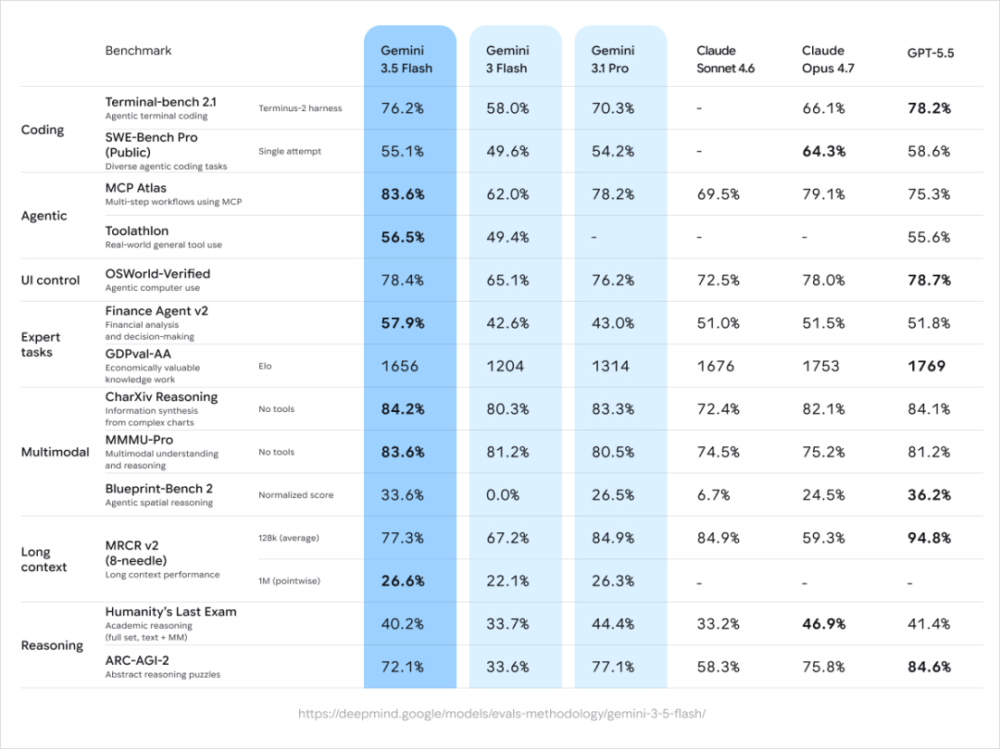

发布会现场公布的对比表：Gemini 3.5 Flash 在 Terminal-bench 编码、MCP Atlas、OSWorld、Agent 类任务上全面超过上一代 3.1 Pro，但在 Humanity's Last Exam（学术知识）和 ARC-AGI-2（抽象推理）上输给 3.1 Pro。这是这次主角模型最直观的「能干活、但博学一些」的取舍。（图源：Google I/O 2026）

挑几条最重要的看：

| 指标 | 测什么 | 3.1 Pro（上一代旗舰）| 3.5 Flash（新轻量版）|
|---|---|---|---|
| Terminal-bench 2.1 | 编码能力 | 70.3% | **76.2%** |
| GDPval-AA | 真实经济价值任务 | 1314 Elo | **1656 Elo** |
| HLE（Humanity's Last Exam）| 世界知识 | **44.4%** | 40.2% |
| ARC-AGI-2 | 抽象推理 | **77.1%** | 72.1% |

这张表读下来是一个清晰的取舍：**牺牲了一部分「博学」，换来了一大块「干活」能力**。前两项是 Agent 真正落地要用的（写代码、调用工具、跑流程），后两项更偏纯学术。Google 这次明确把资源往「干活」这一侧倾斜。

输出速度上，3.5 Flash 比同类前沿模型快 4 倍以上：

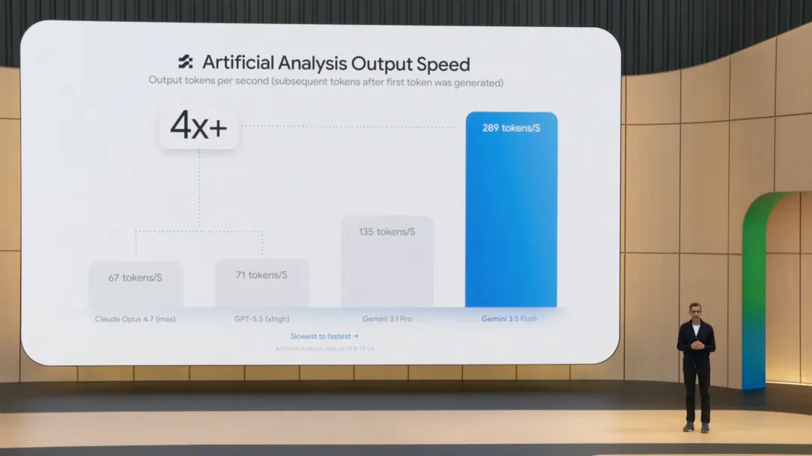

Artificial Analysis 实测：3.5 Flash 输出速度 289 tokens/s，比 Gemini 3.1 Pro（135）、GPT-5.5 xhigh（71）、Claude Opus 4.7 max（67）快 4 倍以上。（图源：Google I/O 2026）

价格上，3.5 Flash 比上一代 Flash 贵了 3 倍，但比上一代 3.1 Pro 便宜 40%。**今天起就成为 Gemini App 和搜索 AI Mode 的默认模型**，所有人都能用。

至于真正的 Gemini 3.5 Pro，Google 在发布会上说"Give us until next month"——下个月再见。

---

## 二、Antigravity 2.0：Google 把开发工具整个推翻重做了

如果说 Gemini 3.5 Flash 是"发动机"，那 Antigravity 2.0 就是"驾驶舱"。

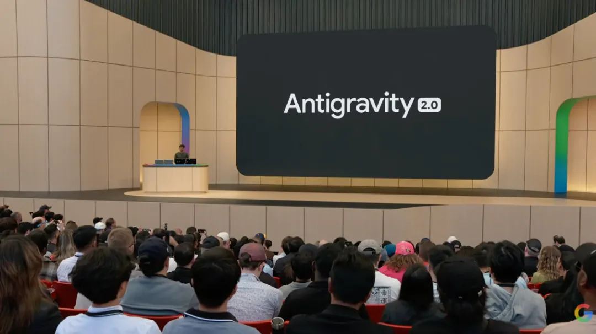

Antigravity 2.0 在 I/O 主舞台揭幕。Google 之前的开发平台 Antigravity 只是一个 IDE 插件，这次直接做成独立桌面应用。（图源：Google I/O 2026）

Antigravity 是 Google 之前发的开发平台，原来只是个 IDE 插件，很难用。这次 2.0 直接做成**独立桌面应用**——一个真正给 Agent 开发用的工作环境。

同时还有几个大动作，对开发者意味着工作流要换：

- 推出 **Antigravity CLI**（命令行工具，简单理解就是程序员在终端里调用 AI 的入口），全球可用
- **2026 年 6 月 18 日之后，老的 Gemini CLI 和 Gemini Code Assist IDE 扩展会停止对 Pro/Ultra 用户服务**，所有开发者要迁到 Antigravity CLI
- 同步上线 Antigravity SDK，开发者可以把 Google 自家用的 Agent 工作框架（harness，可以理解为"让 AI 模型变成完整应用所需的所有外围工程"）直接拿到自己的服务器上跑

Google 现场做了一个挺有冲击力的演示：让 Antigravity 配合 Gemini 3.5 Flash，**从零构建一个可运行的操作系统**。

数据是这样的——93 个 subagent（子 Agent，相当于多个 AI 工人协作）同时跑、用了 12 小时、调用模型 1.5 万次、处理了 26 亿个 token、总成本不到 1000 美元。

最后真的造出来了一个能跑命令行、能跑老游戏 Doom、能放动画的简版 OS。

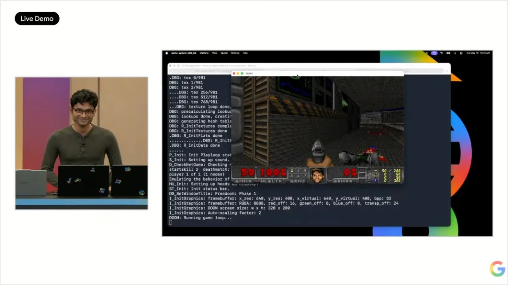

现场演示：93 个子 Agent 并行 12 小时造出的简版操作系统，正在运行老游戏 Doom——左侧终端在打印 OS 启动日志，右侧 Doom 已经进入游戏画面。这件事的意义不是"Doom 能跑"，是 Agent 已经能批量产出可运行的复杂软件了。（图源：Google I/O 2026）

更夸张的是，3.5 Flash 在 Antigravity 里被专门优化过，比别的模型快**12 倍**（不是 4 倍）。

这件事对非开发者的意义是——**Agent 写软件这件事，正在从「能演示」变成「能批量产出」**。整个软件行业的成本结构会被重写。

---

## 三、Gemini Spark：你的私人 AI 助理，在云端 24 小时不下班

这是这场发布会面向普通用户最重要的一个产品。

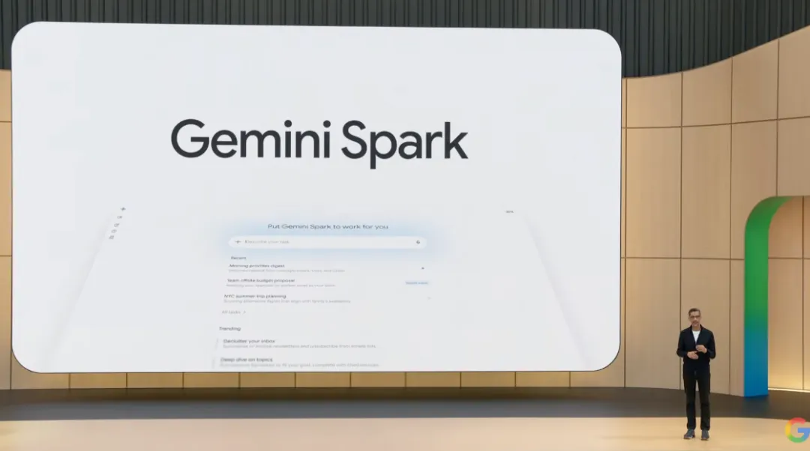

Gemini Spark 主界面：左侧是 Recent（最近的任务，比如"团队周末预算提案"、"NYC 暑期出游规划"），右侧是 Trending（推荐让 Agent 干的事，比如"整理你的收件箱"、"对某个话题做深度调研"）。这是一个真正长得像"任务管理器"的 Agent。（图源：Google I/O 2026）

Spark 你可以理解成 Google 版的"通用个人 AI 助理"——但和你以前用的所有助理都不一样的地方在于：**它跑在 Google 的云端虚拟机上，关掉你的电脑，它在云上继续干活。**

Google 给了两个场景演示：

**工作场景**：让 Spark 给团队写一封邮件，汇总最近一周 Gemini Live 的发布和成绩。Spark 自己去翻你的 Google Docs、邮件、聊天记录，按你的写作风格起草邮件。

**生活场景**：你要办一场街区派对。Spark 在 Google Sheets 里生成一张实时 RSVP（出席回复）追踪表，自动跟 Gmail 打通——邻居在邮件里回一句"我来"，表格里自动更新；没回的邻居，它自己生成催回复的邮件草稿；它还会去 Google Drive 翻出小区 HOA（业委会）的章程，提醒你周五下午之前不能布置充气城堡，最后再在 Google Slides 里做一份派对宣传 deck。

整件事里，**用户只下了一句指令，Spark 自己跨 5 个 Google 产品干完了所有杂活**。

Spark 由 Gemini 3.5 Flash + Antigravity 工作框架驱动，本周对一小批测试人员开放，**下周开始对美国 Ultra 订阅者开 Beta**。

伴随 Spark 一起发布的，是 Google 整个订阅价格的洗牌：

| 套餐 | 价格 | 定位 |
|---|---|---|
| 原 Ultra | 250 美元/月 → **降到 200 美元/月** | 顶配 |
| 新增 Ultra | **100 美元/月** | 给开发者、技术 lead、内容创作者用，5 倍于 Pro 的用量、20TB 云存储、YouTube Premium、Antigravity 优先权 |

Spark 在两档都能用。

---

## 四、Android Halo：手机系统第一次专门给 Agent 设计一个"工位"

Spark 在云端 24 小时干活，那你怎么看它在干什么、做到哪一步、要不要确认？

答案是 Android Halo——Android 手机状态栏顶部一条专门给 Agent 用的常驻区域。Spark 的进度、状态、需要你确认的事，都显示在这里。

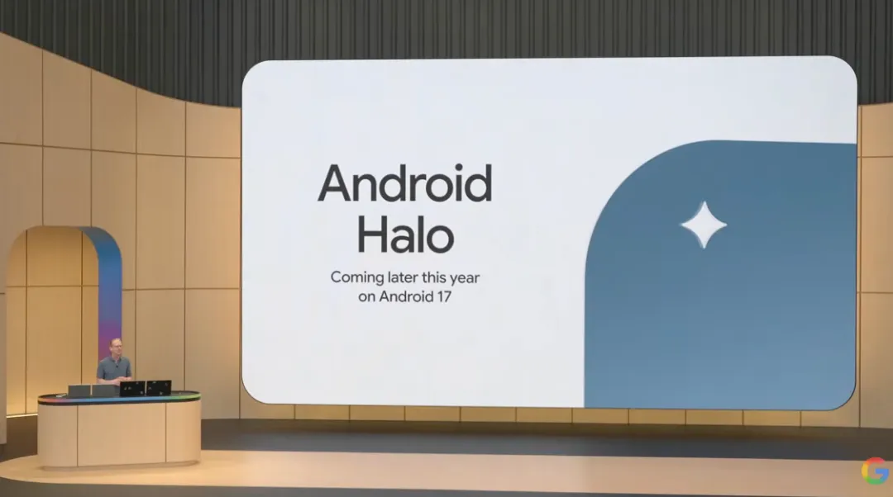

Android Halo 将随 Android 17 在今年晚些时候上线。它是 Android UI 第一次专门为 Agent 单独留出来的一个常驻区域。（图源：Google I/O 2026）

原文作者卡兹克说了一句挺到位的判断：

> 过去的 Android UI 都是给 App 用的，App 是底层逻辑。Halo 开始的 Android，是给 Agent 用的，Agent 是底层逻辑。

翻译成大白话：**过去你用手机，是打开一个个 App；以后你用手机，是和一个 Agent 持续对话，Agent 替你去使唤这些 App。** Halo 是你和 Agent 之间的那块"屏幕"。

这件事会在今年晚些时候上线。如果它跑通了，iOS 大概率会跟。

---

## 五、搜索：1998 年以来最大的一次进化

AI Mode 的月活已经突破 10 亿，每个季度查询量翻倍。今天起底层模型升级成 Gemini 3.5。

四个具体变化：

1. **搜索框 25 年以来最大升级**——现在可以丢图片、文件、视频进去，搜索会跨模态一起理解，并用 AI 帮你把真正想问的问题梳理出来
2. **AI Overviews 和 AI Mode 合并**——从搜索结果页可以自然过渡到对话式追问，上下文一直跟着你
3. **Search Agents**——搜索框里可以创建 Agent，让它 7×24 小时帮你盯一件事。比如你是炒股的，想盯 PE 小于 15、现金流为正、负债低的生物科技股，Agent 自己去查，价格变动给你推送
4. **Agentic Coding 进搜索**——你问「黑洞怎么影响时空」，搜索结果不只是文字，会**实时给你生成一个可以拖拽参数的可视化交互页面**

最后这一项是最有冲击力的一个：

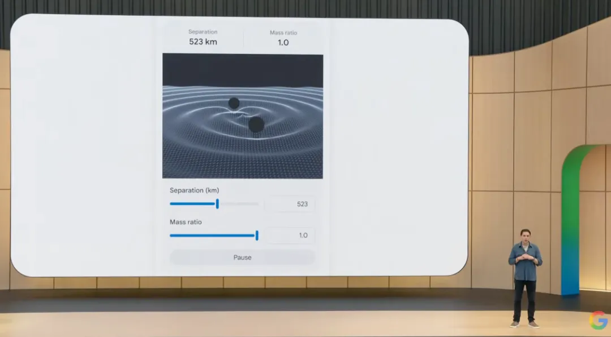

用户在搜索框问黑洞如何影响时空。搜索结果不是一段文字，而是一个**可拖拽参数的交互页面**——可以调整两个黑洞之间的距离（Separation）和质量比（Mass ratio），画面里的时空网格会实时跟着变。背后是 Antigravity + 3.5 Flash 实时写代码、跑代码、把渲染结果嵌回搜索结果。（图源：Google I/O 2026）

这一项今年夏天对所有用户**免费**开放。

把生成式 UI 嵌进搜索结果，可能是搜索这个产品形态从 1998 年到现在 25 年以来最大的一次进化。

---

## 六、Agent 电商三件套：Agent 自己买东西，也需要一套规矩

整个发布会信息密度最高、也最有意思的一块，是**让 Agent 自己买东西**这件事的基础设施。

Google 一次性推出了三个东西：

### 1. Universal Commerce Protocol（UCP，通用商业协议）

简单理解就是"给 Agent 自己去买东西时用的一套通用购物规则"。

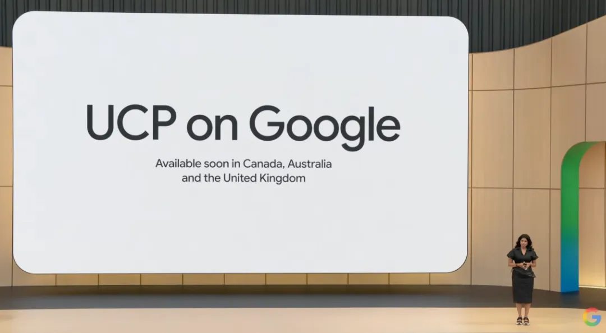

UCP 是 Google 今年一月发布的开源协议，现在从美国开始扩展到加拿大、澳大利亚和英国。它的作用是把零售商、支付方、Agent 三方之间的协议层标准化。（图源：Google I/O 2026）

UCP 一月时只拉到了 Shopify、Etsy、Wayfair、Target、Walmart 五家创始零售商。这次 I/O 大会的新进展是——**Amazon、Meta、Microsoft、Salesforce、Stripe 都加入了 UCP 的技术委员会**。

Google 主导这件事的负责人 Vidya 原话：

> 这可能是我们所有人第一次在同一件事上达成共识。

考虑到 Amazon 和 Google 是电商生态的死对头，这句话不是客套。

### 2. Agent Payments Protocol（AP2，Agent 付款授权协议）

AP2 解决的是一个非常具体的担心——**Agent 自己花钱会不会失控**。

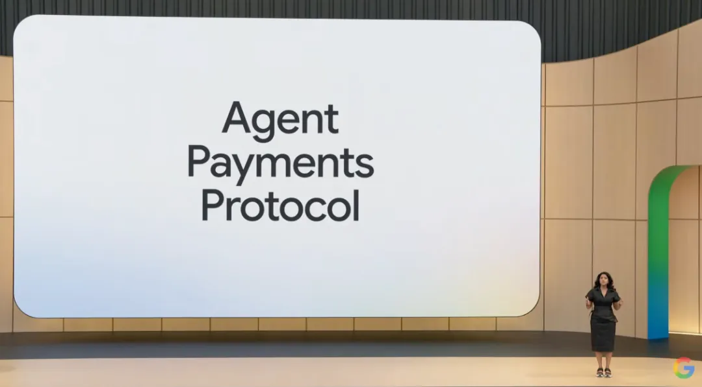

AP2 是这次 I/O 上和 UCP 同台发布的支付协议。它解决的不是"Agent 怎么付款"，是"怎么让你放心让 Agent 付款"。（图源：Google I/O 2026）

它给了用户三道护栏：**具体品牌、具体商品、金额上限**。三个条件全满足，Agent 才能下单。每一笔交易都有一份"防篡改的数字授权书"，你和商家看到的是同一份记录——如果有问题，可以追溯。

AP2 会先在 Gemini Spark 上线。

### 3. Universal Cart（通用购物车）——这是这次真正的新发布

它把"购物车"这个概念，从某一家电商网站里拽了出来，做成了一个**跨商家、跨场景的智能购物车**。

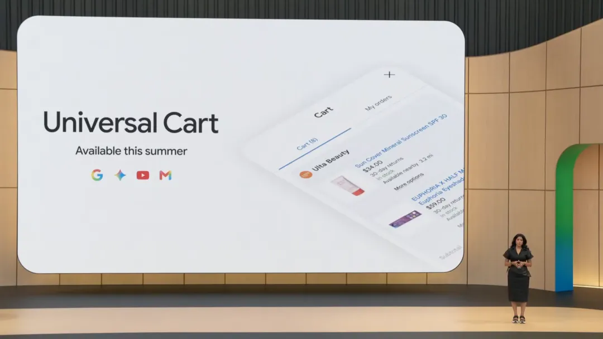

Universal Cart 主界面：左下角是 Google / Gemini / YouTube / Gmail 四个产品图标——意思是这四个地方看到东西都可以加进来。右边的购物车里同时包含 Ulta Beauty 的防晒霜和 EUPHORIA × HALF Magic 的眼影，跨商家共存。（图源：Google I/O 2026）

你在 Google 搜索结果里看到一个东西，可以加进来；在 Gemini 聊天时看到一个东西，可以加进来；看 YouTube 视频时看到，也能加进来；读 Gmail 邮件时看到，也能加进来。

加进来之后，这个购物车自动在后台干活：

- 找折扣、查价格历史、对比你账户里的支付卡权益
- 提醒你某个商品快缺货 / 补货了
- **跨商品检查兼容性**——比如你买电脑配件，先加了主板，它发现你之前买的 CPU 跟这块主板不匹配，主动提醒你换主板

最后一条是 Google 搜索过去 20 年从来没有过的能力。

Universal Cart 今年夏天在美国上线，先进 Search 和 Gemini App，YouTube 和 Gmail 跟进。

**这三件事合起来看的产品意义**：商家面对的不再是"如何在结账瞬间打动一个真人"，而是"如何让自己的商品被一个 Agent 召回"。商家的 SEO（搜索引擎优化）思路，未来会被 AEO（Agent 引擎优化）替代。

---

## 七、第八代 TPU：训练和推理第一次分家

第八代 TPU（Google 自研 AI 芯片）这次最大的变化是**双芯片路线**——训练芯片叫 TPU 8t，推理芯片叫 TPU 8i。

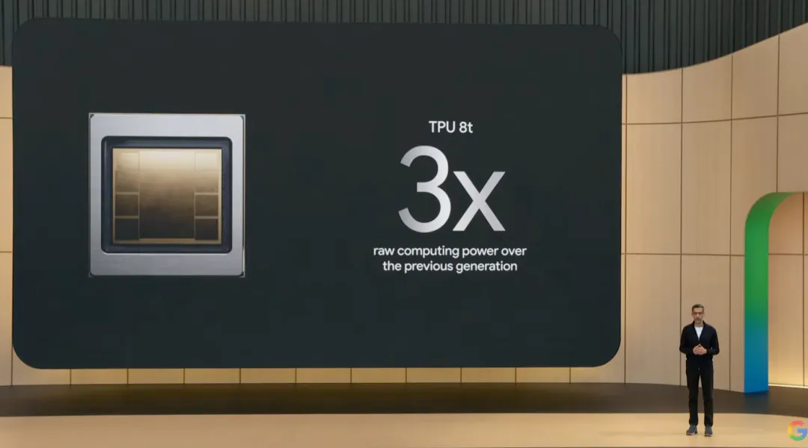

TPU 8t 是第八代里的训练芯片，**原始算力接近上一代的 3 倍**。同时配套基础设施 Jackson Pathways 可以把训练任务分布到多个数据中心，最高跨全球 100 万颗 TPU 一起跑。（图源：Google I/O 2026）

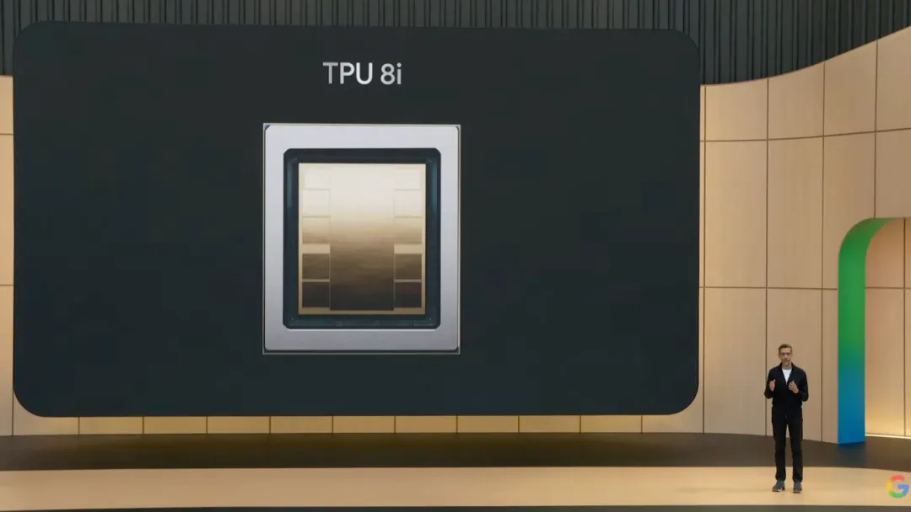

TPU 8i 是第八代里的推理芯片，专门为低延迟、高速生成优化。现场用一个即将发布的 Flash 模型演示生成 Chrome 小恐龙游戏，速度达到了**每秒 1500 个 token**——快到肉眼跟不上。（图源：Google I/O 2026）

这意味着两件事：

1. **算力护城河又被抬高一档**。之前比的是单个数据中心能塞多少芯片，现在比的是能不能把多个数据中心做成一个逻辑超算。
2. **训练 / 推理算力分家成为行业标准动作**。谁还在用同一颗芯片做两件事，单位经济会被甩开。

OpenAI、Anthropic、Meta 大概率都得跟进。

---

## 八、其他几件值得知道的事

**SynthID（AI 内容水印）联盟扩大**：Google 给 1000 亿张图片视频、6 万年时长音频打过水印。这次 **OpenAI、Kakao、ElevenLabs 加入了 SynthID**。OpenAI 和 Google 过去三年是死敌，这次在「反 AI 造假」这件事上放下了竞争。这是发布会最有故事感的一个细节——意味着 AI 生成的假图、假声音、假视频已经严重到大家不得不一起合作。

**Android XR 智能眼镜**：今年秋天会发首款**音频眼镜**（没有镜片显示屏，靠声音交互）。Gentle Monster 和 Warby Parker 做外观，三星做硬件，同时支持 iOS 和 Android。

**Docs Live**：你不用再敲字给 Gemini 写指令了——直接说话，说乱了也没关系，Gemini 自己整理；中途改主意，比如说 Thursday 然后立刻改口说 Friday，Gemini 会自动改掉。今年夏天对 Pro/Ultra 订阅者开放。

**Code Mender**：自动找代码里的安全漏洞并修好。今天起对一小批专家开放 API 测试。Agent 写的代码越来越多，自动找漏洞修漏洞会成为基础设施。

**Gemini Omni Flash**（全模态视频生成）实测拉胯：中文一股港台腔，效果不如 Seedance。Google 自己也承认只是 Omni 家族的第一个模型，Pro 版即将发布。

---

## 九、对我们的启发

如果只挑三件事记住，是这三件：

1. **小模型超过老旗舰，已经是新常态**。不要再用「Pro 才是好的」的旧直觉做工具选型，要看具体任务上的新榜单。
2. **Agent 不再是 Demo，开始有完整的产品落地**。从开发工具（Antigravity）、到个人助理（Spark）、到手机系统（Halo）、到搜索、到电商，Google 一次性把整条链路都端出来了。这意味着**未来 12 个月，你身边「让 AI 替你干完整流程」的产品会成倍出现**。
3. **商家的入口正在从「人」换成「Agent」**。Universal Cart 让 Agent 跨商家自动比价、检查兼容性、找折扣。普通员工岗位上能用的判断是——**任何"靠人工选品 / 比价 / 配置"的环节，未来 1–2 年都会被 Agent 接走**。

Hassabis 在发布会结束时说了一句话：

> 当我们回望这个时刻时，我想我们会意识到，我们正站在奇点的山脚下。

句子有点大。但回头看 I/O 2026 这一场，更准确的描述也许是——**这是 AI 第一次开始大规模有形地接管「事情怎么被完成」的细节。**

---

## 扩展阅读

本文参考了以下原作者的文章（推荐读原文）：

- 《帮大家总结了一下凌晨的 Google I/O 2026 开发者大会。》 · **数字生命卡兹克**（微信公众号）· [原文链接](https://mp.weixin.qq.com/s/X6RFAIY1skuMQITuG-M7Yg)
