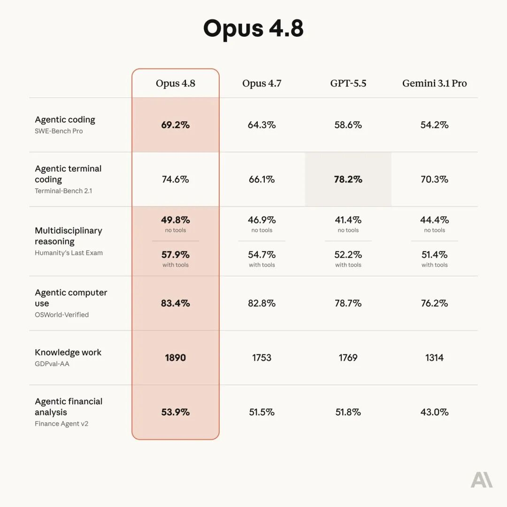
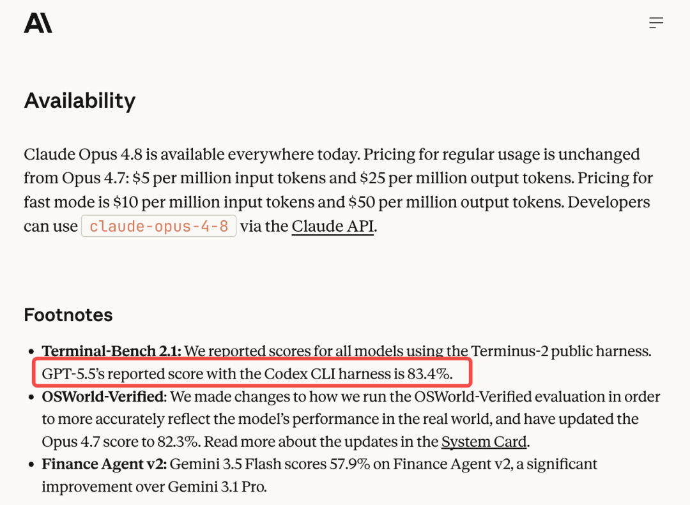
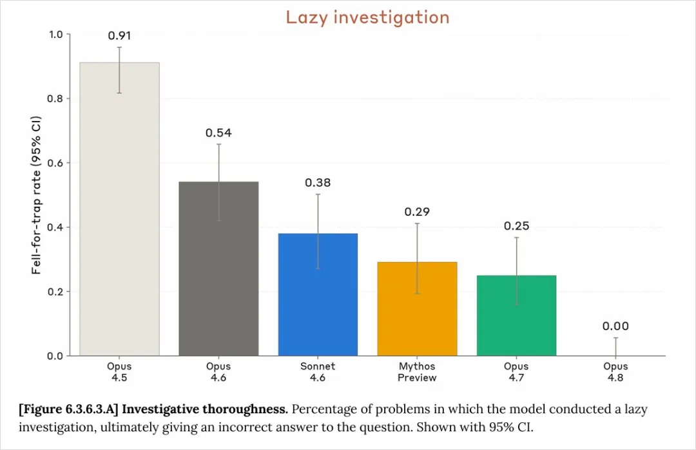
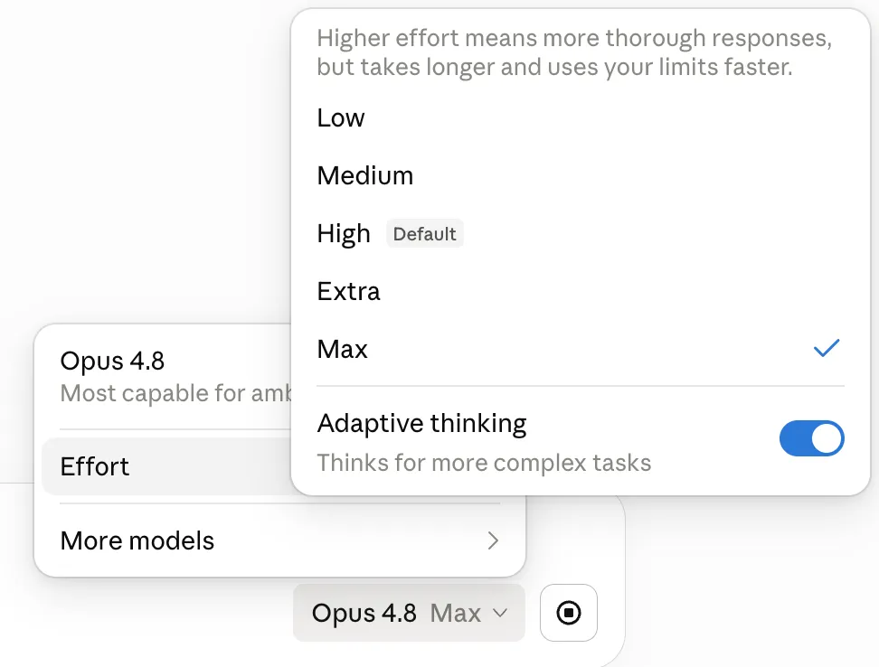
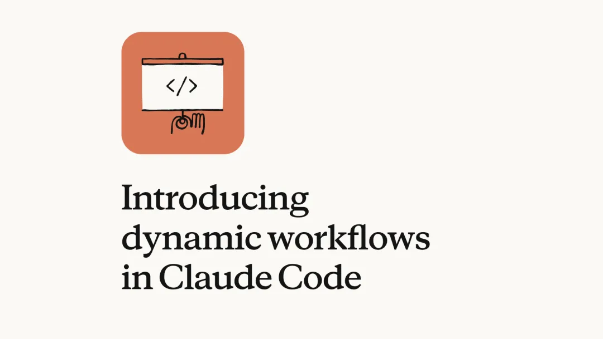

# 2026/05/29 · Claude Opus 4.8：一次「不炸裂」的更新，但藏着转向

5 月 29 日凌晨，Anthropic 发布了 Claude Opus 4.8。

这件事有点出人意料。距离上一版 Opus 4.7 发布，才过去 **41 天**——一个多月。在大模型行业，新模型一般半年起步，Claude 自己的历史上也从来没有过这么快的节奏。

与此同时，Anthropic 还官宣了另一条消息：完成 650 亿美元融资，投后估值逼近一万亿美元（9650 亿美元），年化收入已经突破 470 亿美元。

我们把官方发布稿、官方测试报告和多方实测放在一起看，比单看任何一边都更完整。这篇就按「跑分 → 真正的升级 → 节奏背后」这条线，把对普通用户真正有用的几件事讲清楚。

---

## 一、先把跑分这件事说清楚

每次新模型发布，第一张图永远是跑分对比表。Opus 4.8 这张表照例几乎全面领先，但有两个细节比「又赢了」更值得注意。

官方对比表：Opus 4.8（左侧高亮列）在 6 项里有 5 项领先，唯独「Agentic terminal coding（Terminal-Bench 2.1）」这一行，GPT-5.5 的 78.2% 反而是最高的（那一格被单独框了出来）。（图源：Anthropic 官方博客）

**第一，官方自己很克制。** Anthropic 在发布稿里用的词是 **modest**——意思是「温和的、不大的」更新。这和国内部分自媒体「炸裂」「碾压」的标题形成了明显反差：离模型最近、最该吹的厂商反而最冷静。

**第二，有一项它输了，而且输得有讲究。** 就是上面那张表里被框出来的那一格——**Terminal-Bench 2.1**。

> 解释一下这个词：它是用来考「AI 在真实命令行环境里能不能独立干活」的测试。简单说，就是把 AI 丢进一个电脑终端，给它一堆只能靠敲命令解决的活儿（装环境、调试报错、跑脚本），看它能不能像工程师一样一步步自己搞定。一个任务往往要几十步，中间出错还得自己排查。它被看作「AI 自主开发能力」的一个高峰指标。

Opus 4.8 在这项上从 4.7 的 66.1% 涨到 74.6%（涨了 8.5 个点，是这次所有项目里涨幅最大的一项），但还是输给了 GPT-5.5 的 78.2%。

更有意思的是脚注里的一处细节：

Anthropic 官方博客脚注：对比表里 GPT-5.5 写的是 78.2%（已经高于 Opus 4.8 的 74.6%），但脚注里又承认——GPT-5.5 换成它自家的测试框架跑，是 83.4%。（图源：Anthropic 官方博客）

这里要补一个普通读者很少注意、但很关键的常识：**同一个模型，用不同的「测试框架」（harness，可以理解成不同的考场和监考规则）跑同一场考试，分数可能差好几分。** 所以跑分表如果不注明用的哪套框架，本身就不太可比。

这个脚注可以有两种理解。一种偏中性：Anthropic 在「选不同的山头」——它在「理解既有代码、多文件改动、长链条任务」上更强，在「纯命令行操作」上确实弱一点，于是把宣传重点放在自己擅长的方向，「擅长的方向赢得彻底」比「每项都打」更聪明。另一种更尖锐：官方表里只放对 GPT-5.5 不利的 78.2%、把 83.4% 藏进脚注，等于给对手挑了一个不利的考场。

不管哪种解读，对我们的启示是一致的：**看模型跑分，别只看那张被疯转的大表，要去看注明了什么测试条件**。

---

## 二、真正值钱的升级：它更愿意承认「我不确定」了

跑分看完也就看完了。这次发布稿真正花最大篇幅讲的，是一个跑分表上根本看不到的东西——**诚实**。

所有大模型都有一个通病：爱给自己脸上贴金。你让它写段代码、做个分析，它经常一脸自信地说「搞定了，没问题」，但里面其实埋着雷，它自己也没真验过。等你一跑出错回去问，它又特别自信地说「找到了，这下绝对没问题」，结果又错。

Opus 4.8 在这件事上做了重点优化。

官方给的量化数字是：Opus 4.8 在自己写的代码里「让缺陷悄悄溜过去」的概率，大约是上一代的四分之一。用大白话翻译这个「四分之一」：以前它写完代码，四个雷里大概帮你点出一个；现在四个雷能帮你点出三个，剩下一个才轮到你自己踩。

这次的系统卡（System Card——厂商每次发模型时随附的一份官方报告，难得的是它会主动公布模型的缺点和风险数据，不只讲优点）里，还有一张更说明问题的图：

系统卡里的「偷懒调查」对比图：纵轴是「掉进陷阱、最后给出错误答案」的比例。Opus 4.5 高达 0.91，一路降到 4.7 的 0.25，而 **Opus 4.8 是 0.00**——在这项测试里没偷过一次懒。（图源：Anthropic 系统卡）

也就是说，在「偷懒」这个指标上，Opus 4.8 做到了 **0% 不良率**——可以说是目前第一个在这项测试上不偷懒的模型。实际用起来也能感觉到：同一个又卡又慢的数据分析页面，4.7 会嘴硬「实时查询就是这速度，改不了」，4.8 则会老老实实地全面审查代码，去找能优化的地方。

这个升级听起来不性感，没有「跑分屠榜」唬人。但凡真拿 AI 干过活的人都明白：**一个会主动说「这里我没把握」的助手，比一个永远信誓旦旦、关键时刻给你挖坑的助手，靠谱太多了。**

---

## 三、把决定权还给用户：Effort 控制回归

Opus 4.7 当初被吐槽最多的一点，是它有个「自动判断要不要深入思考」的机制——模型自己决定这次是认真想还是敷衍答。很多人的不满是：「我是花钱的甲方，凭什么由你来决定今天要不要好好干？」

4.8 把这个决定权交回来了。

现在普通用户在 claude.ai 上也能调「努力程度」（Effort）了，就在模型选择旁边：从 Low 到 Max 五档（这次默认就是 High）。调高，它想得更深、答得更好，但更慢、更费用量；调低，它回得更快、更省。急活儿调低，硬活儿调高。所有套餐（包括免费用户）都能用。（图源：Claude 官方界面）

说人话就是：**以前是模型替你决定花多少力气，现在你能自己拧这个旋钮了。**

---

## 四、动态工作流：从「问一句答一句」到「交代一个目标，它自己组队干完」

这次和 4.8 一起发布的，还有一个对工作方式影响更大的新功能——**动态工作流（Dynamic Workflows）**，目前在 Claude Code（Anthropic 的编程工具）里做研究预览。

一句话说清它干嘛的：以前你给 AI 派个大活儿，它是一步一步串着干，你得在旁边盯着。现在你说一声，它能自己先把活儿拆开，**一口气拉起几十到几百个「分身」并行去做，做完还会自己先验一遍货，确认没问题了再回来汇报。**

Anthropic 官方发布的「动态工作流」功能。它能把一个大任务自动拆成多个阶段、拉起几十到几百个「分身 Agent」并行执行，其中还有专门的分身去挑其他分身的毛病，最后自己验过再汇报。（图源：Anthropic 官方博客）

Anthropic 举的例子很猛：用它能把一个几十万行代码的项目，从动工到完成整套迁移自己干完，验收标准就是现有的测试能不能跑通。社区里最有说服力的案例是一个叫 Bun 的开源项目——用动态工作流，11 天产出了约 75 万行代码（虽然质量上还有争议，但产出量级确实是过去没有过的）。

这意味着 AI 干活的形态正在变化：**从「你问一句它答一句」的助手，变成「你交代一个目标，它自己组队把活儿包圆」的工头。** 用 Anthropic 自己在报告里的话说就是——「工程师的工作，正在从写代码，变成协调写代码的 AI」。

需要泼一盆冷水：这个功能目前还很少有人真正跑出「几百个分身」的完整场景，真实可靠性如何还得用了才知道；而且它非常费钱（消耗的算力远超普通使用），更像是给「要迁移百万行老代码的大企业」准备的，不是给个人每天用的。

---

## 五、Fast 模式降价：这个红包不是发给个人的

这次还升级了「快速模式」（Fast 模式）——速度是普通模式的 2.5 倍，价格降到了上一代快速模式的三分之一。

这里有个很多报道讲错的地方需要澄清：**「便宜三分之一」是跟自家上一代快速模式比，不是跟普通模式比。**

| 模式 | 输入价 | 输出价 |
|---|---|---|
| 上一代快速模式 | 30 美元 | 150 美元 |
| **Opus 4.8 快速模式** | **10 美元** | **50 美元** |
| Opus 4.8 普通模式（参照） | 5 美元 | 25 美元 |

（价格单位：每百万 token；token 可以粗略理解成 AI 处理文字的计量单位，大致对应字数——一百万 token 差不多是几十万字的量）从表里能看清：所谓「降三分之一」是快速模式自己跟自己比；要是跟普通模式比，快速模式仍然贵了 2 倍。

为什么降价？背景是这样的：之前有大企业（比如微软）因为 Claude 编程工具的账单太贵，一度要求员工停用。Fast 模式这次降价，针对的是这些**用量巨大的企业客户**，目的是别让它们因为成本压力跑去用竞争对手。

对个人用户来说，这个红包基本用不上——日常订阅档已经够用，快速模式本来就不是给个人准备的。普通模式的价格这次一分没涨，还是输入 5 美元、输出 25 美元每百万 token。

---

## 六、一个容易被忽略的两面性：更精确，但也更不主动

前面说的都是好消息。但实测会暴露一个值得所有人注意的两面性。

4.8 变得**更精确、更听话**了——你让它干 A，它就规规矩矩干 A，错误率和「想当然」都降低了。对设计好了工作流程的专业开发者，这是好事。

但代价是：**它的主动性变弱了。** 以前的版本，你含含糊糊扔一句话过去，它会猜你心里那个完整的需求，顺手把你没明说的事也办了。现在实测会发现，它好几次都不再像老版本那样主动去连服务器查线上数据，只按字面意思办事，反而添了麻烦。有人形容得很形象：给 4.8 下指令，「跟强迫一个 i 人主动说话一样」——你不点它，它就不主动开口。

这件事对不同人意义相反：

- 对**专业用户**：更精确 = 更可控，是进步。
- 对**普通用户 / 新手**：很多人用 AI 恰恰是靠它的「主动性」往前走的——你说不清楚，它帮你补全。模型越「只听字面指令」，对这部分人反而像是退步。

所以一个实在的结论是：**用 Opus 4.8，把需求说清楚比以前更重要了。** 你越能讲明白「我到底要什么、什么算做完了」，它干得越好。

---

## 七、41 天发版 + 650 亿融资：节奏背后是什么

回到开头那两条消息：41 天就发一版、650 亿融资估值近万亿。这两件事其实是一件事。

这里有一个容易被忽略、却很关键的细节：Opus 4.7 和 4.8 的「知识截止时间」完全一样（都是 2026 年 1 月）。这说明这 41 天里，Anthropic **大概率没有重新训练底层大模型，只是在原模型上做了快速微调**。

这件事的意义是：当一家公司算力和资金都很充足、手里又压着一个比现有版本更强的「天花板」模型时，它可以不必半年磨一剑，而是**随时切一个小版本出来狙击对手**——4.8 这个时机，刚好卡在传闻中的 GPT-5.5 后续版本之前。

事实上，Anthropic 这次确实留了个钩子：它手里那个代号 **Mythos**、比现在的 Opus 还强一档的模型，说是「过几周」就会向所有客户开放。

所以 Opus 4.8 与其说是一次大升级，不如说是个**过渡**——在掏出真家伙之前，先递过来的一杯水。水不解渴，但它告诉你，正菜快上了。

---

## 八、对我们的启发：到底要不要换

把四篇的判断汇总一下，给一个实在的结论：

1. **如果你用 Claude 写代码、跑长流程任务**：建议换。理由不在跑分表，而在两件事——它更愿意跟你说实话了（不偷懒、会承认不确定），以及能放出去干更大的活了（动态工作流）。价格还没涨。

2. **如果你主要用 Claude 做内容创作**：可以不急。多位作者一致反馈，4.8 的写作能力比 4.7 进步了，但仍明显不如已经下线的 Opus 4.6——「AI 腔」还是挺重。可惜 4.6 这次被顶掉了。

3. **不管你用哪一版，养成一个习惯**：把需求说清楚。4.8 这一代的特点是「听话但不主动」，你表达得越具体，它干得越好。

4. **看 AI 新闻时的一个通用方法**：别被「炸裂」标题带节奏。去看官方自己用什么词（这次是 modest）、去看跑分注明了什么测试条件。一手信息往往比二手解读更冷静。

最后，真正值得盯的下一个节点是 **Mythos**——那个「过几周开放」、比现在更强一档的模型。它才是 Anthropic 这一轮真正想端出来的菜。

---

## 扩展阅读

本文参考了以下原作者的文章（推荐读原文）：

- 《Opus 4.8 发布，但最值钱的升级不在跑分榜上》 · **AI范儿**（微信公众号）· [原文链接](https://mp.weixin.qq.com/s/oIOAqbJObHEezjsotcANUA)
- 《Opus 4.8发布：41天补丁包里，Anthropic藏了一次战略转向》 · **花叔**（微信公众号）· [原文链接](https://mp.weixin.qq.com/s/IyrL-jLCSrshoasBON3Odw)
- 《Claude Opus 4.8并没有炸裂，炸裂的是中文AI圈的浮躁》 · **刘小排r**（微信公众号）· [原文链接](https://mp.weixin.qq.com/s/vIs-mv2yzhPoTTRUk_7cJw)
- 《实测Claude Opus 4.8，这可能是第一个不会偷懒的模型。》 · **数字生命卡兹克**（微信公众号）· [原文链接](https://mp.weixin.qq.com/s/Lt4wUq63d7cfHIUHwkydAg)
