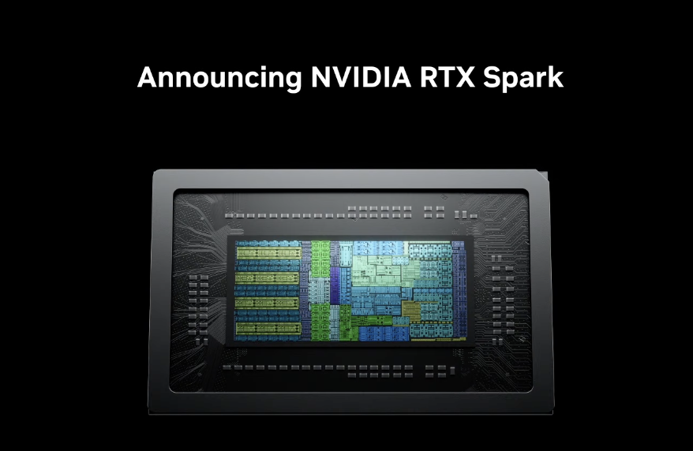
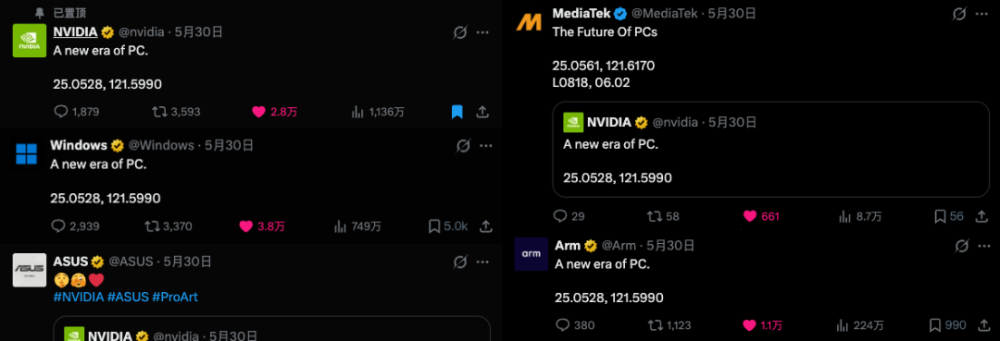
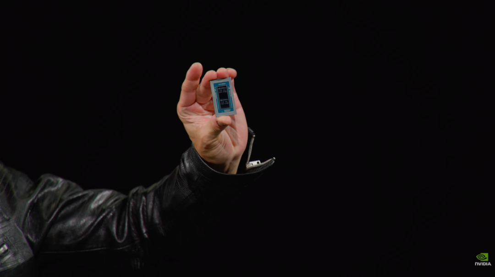
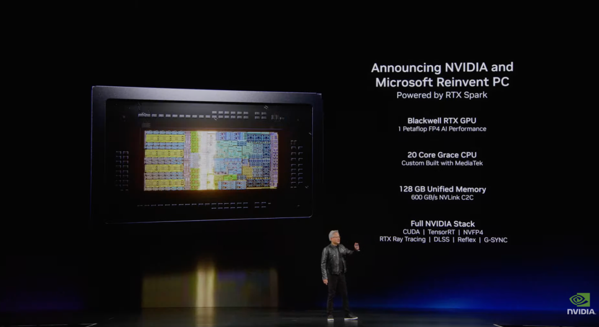
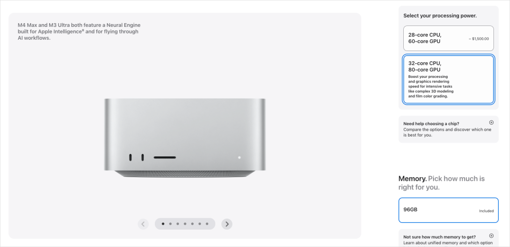
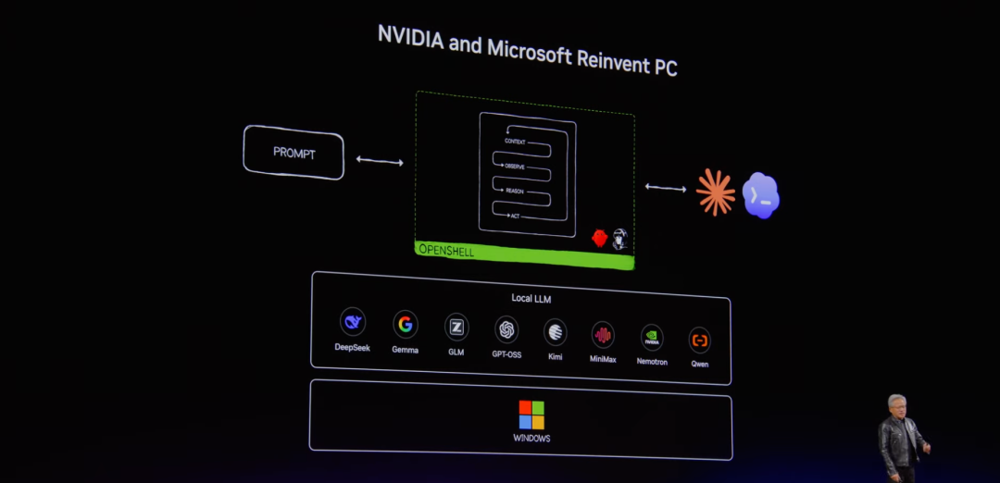
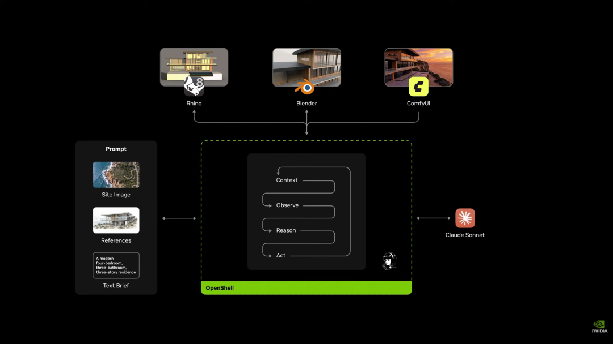
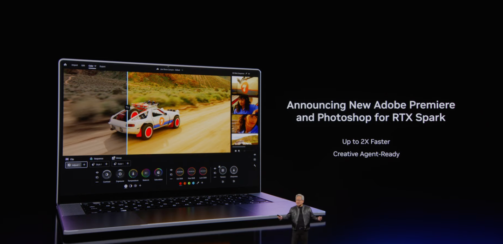
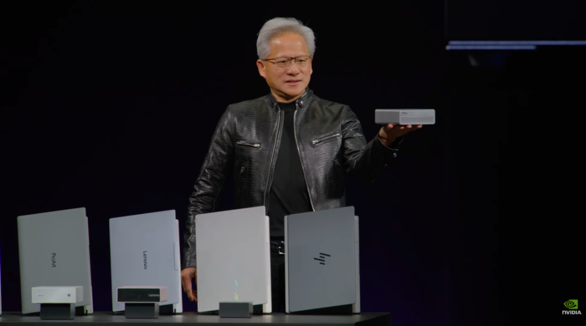
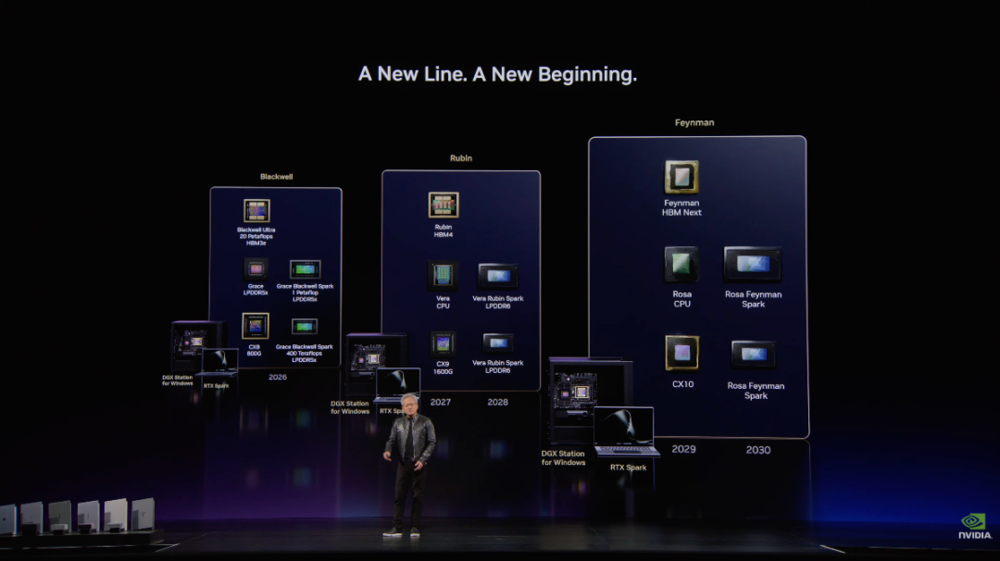

# 英伟达 RTX Spark：把"能跑大模型的 AI 电脑"搬上你的桌面

2026 年 6 月 1 日 · AI 新闻

6 月 1 日，英伟达在 **GTC Taipei 2026**（英伟达每年的技术大会，这次在台北）上发布了一款新产品：**RTX Spark**。

它不是一块显卡，也不是普通笔记本芯片，而是一颗面向 Windows 电脑的"超级芯片"。英伟达和微软给它的定位很大——**让个人电脑从"运行软件的机器"，变成"在本地就能跑大模型和 AI 智能体的机器"**。

英伟达在 GTC Taipei 2026 正式发布 RTX Spark（屏幕上是它的芯片主体）。（图源：NVIDIA 发布会）

发布前一天，这件事就被预热得很足。

发布前一天，NVIDIA、Windows、Arm、联发科（MediaTek）、华硕（ASUS）等多家公司在 X 上几乎**同时**发出同一句话——"A new era of PC."（PC 的新纪元），定位坐标都指向台北。一次硬件发布能拉上这么多操作系统、芯片、整机厂商一起站台，本身就说明它们想推的不只是一款产品。（图源：NVIDIA、Windows、Arm、联发科、华硕官方 X 账号）

下面按"**它是什么 → 解决了什么老问题 → 为什么不只是更快**"这条线，把对普通人真正有用的几件事讲清楚。

---

## 一、先看清楚它是个什么东西

发布会的主角，是黄仁勋手里举起的那一小块芯片。

黄仁勋在 GTC Taipei 2026 现场举起 RTX Spark 芯片——这一小块东西，就是整台"个人 AI 计算机"的核心。（图源：NVIDIA 发布会）

它的配置，官方用一张图列得很清楚：

RTX Spark 官方规格（屏幕右侧）：**Blackwell RTX GPU**（最高 1 PFLOP FP4 AI 算力）、**20 核 Grace CPU**（与联发科联合定制）、**128GB 统一内存**（600 GB/s NVLink-C2C 带宽），以及完整的 NVIDIA 软件栈（CUDA、TensorRT、DLSS、光线追踪等）。（图源：NVIDIA 发布会）

几个关键数字翻译成人话：

- **1 PFLOP AI 算力**：PFLOP 是"每秒一千万亿次运算"。这个数量级，过去是数据中心服务器才有的水平，现在被塞进了一台个人电脑。（FP4 是一种"低精度"的计算方式，专门用来让 AI 跑得更快更省，这里不用深究。）
- **128GB 统一内存**：这是最关键的一条，下一节专门讲。
- **基于 Arm 架构、与联发科联合定制**：注意这点——它不是传统 Windows 电脑那种 Intel/AMD 的 x86 芯片，而是用了手机、苹果电脑那一脉的 **Arm 架构**。这是 Windows PC 的一次路线变化。

---

## 二、它解决的，是"在自己电脑上跑大模型"的老大难

为什么需要这么一台机器？因为想在自己电脑上跑大模型，过去一直卡在两个地方。RTX Spark 的价值，正是同时解决了这两个。

### 卡点一：内存"装不下"——靠统一内存解决

普通电脑里，内存（RAM，给 CPU 用）和显存（VRAM，给显卡用）是**分开的两块**。大模型主要靠显卡跑，可消费级显卡的显存通常就几 GB 到二十几 GB，**模型稍微大一点就塞不进去**；一旦塞不下，数据就得在内存和显卡之间来回搬，速度直接慢下来。

> **名词小注：统一内存**
> 指 CPU 和 GPU **共用同一大块内存池**，而不是各分一块、互相搬运。这样显卡能直接用上一大片内存，不再被那点显存容量卡死。RTX Spark 的 128GB 统一内存，意味着本地能跑得下过去只能在云端跑的大模型。

这个思路并不新鲜，苹果的 Mac 早就这么干了：

苹果 Mac Studio 早就用"统一内存"（图中内存可选到 96GB 起步），这也是不少人用 Mac 跑本地大模型的原因。但 Mac 有个短板——见下。（图源：Apple 官网）

### 卡点二：生态"跑不动"——靠 CUDA 解决

Mac 虽然有统一内存，却有个绕不过的短板：**AI 开发生态不通用**。绝大多数 AI 工具、框架，都是优先为英伟达的 **CUDA** 写的、调好的。

> **名词小注：CUDA**
> 英伟达为自家显卡做的一整套通用计算软件生态，已经积累了近二十年。可以理解成 AI 圈"事实上的通用语"——几乎所有主流 AI 框架都默认支持它。这正是英伟达最深的护城河。

于是过去就成了一个二选一的尴尬：**要统一内存（Mac），就得放弃最通用的 CUDA 生态；要 CUDA（传统 NVIDIA PC），又被那点显存容量卡死。**

RTX Spark 的关键，就是**第一次把"大容量统一内存"和"CUDA 生态"捏到同一台消费级电脑上**——装得下，又跑得顺。这正是它被称为"重新定义个人电脑"的核心理由。

---

## 三、为什么说它不只是"更快的电脑"

如果只是参数变强，那还算不上"新纪元"。RTX Spark 真正想干的事，是配合微软，把 Windows 改造成一个**能安全地跑"本地 AI 智能体"的平台**。

> **名词小注：本地 Agent（本地智能体）**
> Agent（智能体）是能自己拆解任务、调用软件、一步步把活干完的 AI。"本地"的意思是它跑在你**自己这台电脑**上，能直接读你的文件、操作你的软件，而不用把数据传到云端——更快，也更私密。

英伟达和微软给出的本地 Agent 架构：最底层是 **Windows**，往上是英伟达的 **OpenShell** 运行环境，里面可以跑 DeepSeek、Qwen、Gemma、GPT-OSS 等一排**本地大模型**；最上层，Agent 在"理解（Context）→ 观察（Observe）→ 推理（Reason）→ 行动（Act）"的循环里替你干活。（图源：NVIDIA 发布会）

发布会上演示的一个场景很能说明问题——**让本地 Agent 自己去操作你电脑上的专业软件**：

一个真实演示：你只给出文字需求（"一栋现代四居室、三层住宅"）和参考图，本地 Agent（这里接入了 Claude Sonnet）就自己调度 Rhino、Blender、ComfyUI 这几款本地创意软件，一步步把设计方案做出来。（图源：NVIDIA 发布会）

创意软件厂商也跟着站台了：

Adobe 宣布 Premiere 和 Photoshop 适配 RTX Spark，官方称最高快 2 倍（Up to 2X Faster），并支持"创意 Agent"（Creative Agent-Ready）。（图源：NVIDIA 发布会）

这里两篇原文都点了同一句关键判断，值得记住：

> **本地 Agent 能不能普及，瓶颈往往不是模型本身够不够聪明，而是你天天用的这台电脑，能不能安全、私密、低延迟地把它跑起来。** RTX Spark 想抢的，就是这个"个人 AI 计算入口"。

---

## 四、形态：从轻薄本到迷你主机都有

RTX Spark 不是单一一款机器，而是一条产品线，多家整机厂商一起做：

黄仁勋手里是一台搭载 RTX Spark 的**迷你主机**，台前一排是华硕 ProArt、联想（Lenovo）、惠普（HP）等厂商做的 RTX Spark **笔记本**——从轻薄本到小主机都覆盖了。（图源：NVIDIA 发布会）

---

## 五、怎么看：别急着下单，但方向值得记住

最后泼点冷水，把火候压一压。

**第一，这次更多是"亮相和定位"。** 这场发布主要在讲能力和愿景，至于具体价格、上市时间、实测表现，还要看后续——产品图很漂亮，但要不要为它换电脑，等真东西出来、有了独立评测再说。

**第二，"本地跑大模型"目前更多是开发者、创作者的需求。** 对普通用户来说，云端 AI（豆包、ChatGPT 这些）已经够用、而且免费或便宜。本地 AI 电脑的核心卖点是**隐私**（数据不出本机）和**低延迟**，这对处理敏感资料、做专业创意和开发的人价值更大，对日常聊天写作的人短期内未必划算。

**第三，真正值得记住的是方向，不是这一款产品。** 过去两年 AI 几乎都在云端；而 RTX Spark 代表的趋势是——**AI 开始往"本地、个人设备"回流**。你的电脑可能正在从"运行软件的工具"，变成"养着一个本地 AI 助手的地方"。

英伟达把 RTX Spark 放进了一条长期路线图（Blackwell → Rubin → Feynman，规划到 2030 年）。这说明"个人 AI 计算机"在它眼里不是一次性产品，而是一条要做很多年的新产品线。（图源：NVIDIA 发布会）

---

> **一句话总结：** RTX Spark 把"大容量统一内存 + CUDA 生态 + 本地 Agent 平台"第一次凑到一台消费级电脑上，想抢的是"个人 AI 计算入口"。它对普通人最大的意义不在参数，而在一个信号——**AI 正在从云端，搬回到你自己的设备里。**

---

## 扩展阅读

本文综合了以下两篇报道与解读（一篇偏官方规格、一篇偏概念解读），想看更多细节和原图，推荐读原文：

- [《刚刚，英伟达重新定义PC！史上最高效CPU来了》](https://mp.weixin.qq.com/s/u_uZI2Ip1YCMjvAReZBeuw) · **机器之心**（微信公众号）—— 偏官方规格与发布事实
- [《英伟达发布全新 RTX Spark - 个人PC的新时代》](https://mp.weixin.qq.com/s/jUsial-TLeFIw82st-jKGw) · **数字生命卡兹克**（微信公众号）—— 偏统一内存、CUDA 与本地 Agent 的概念解读

> 本文为 AI 学习知识库原创整理，配图取自 NVIDIA 发布会等公开来源（已在图注标明）。具体参数与价格请以英伟达官方为准。
