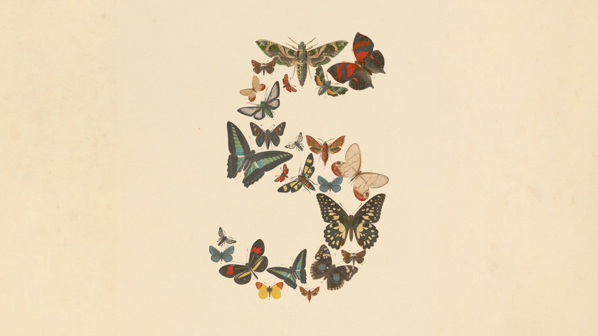
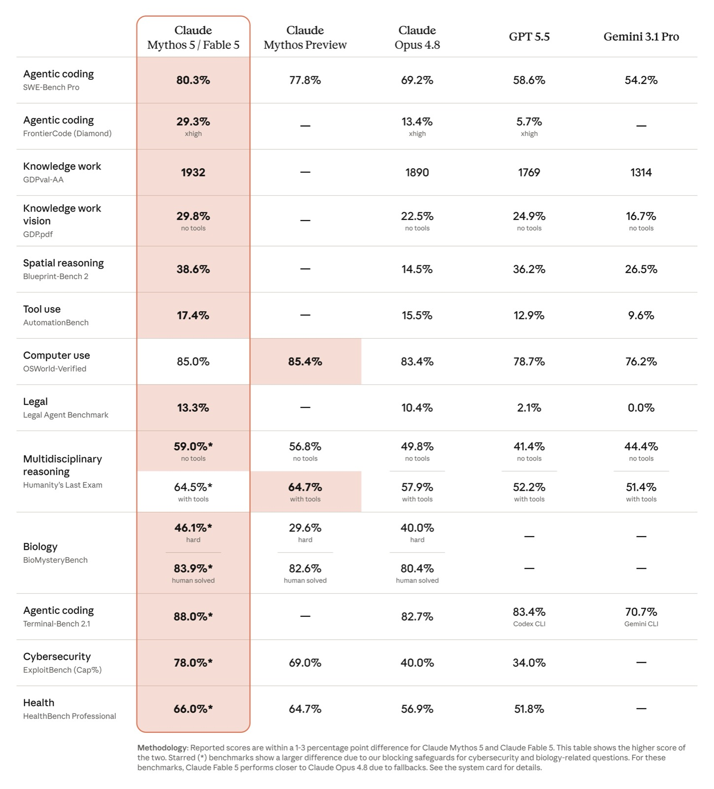
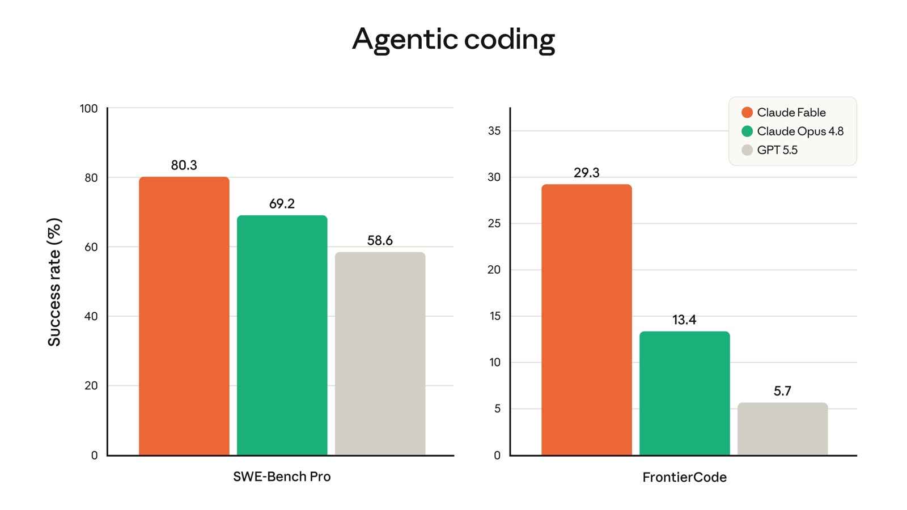
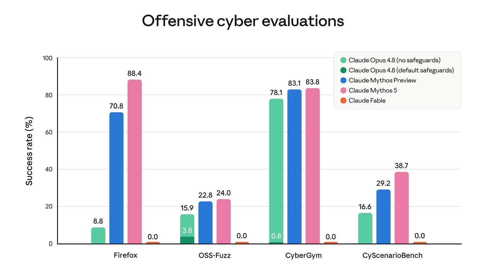
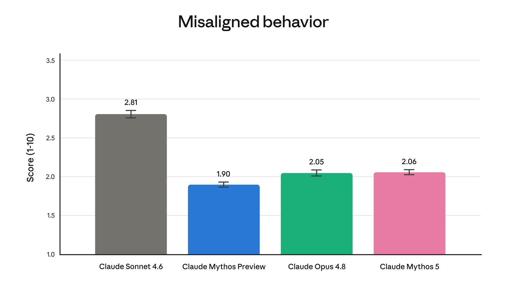
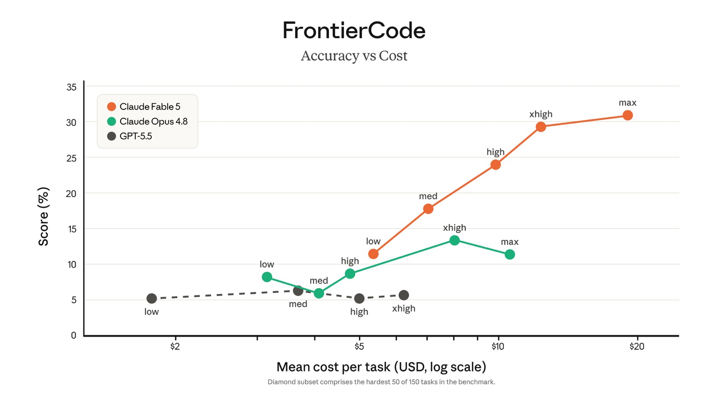
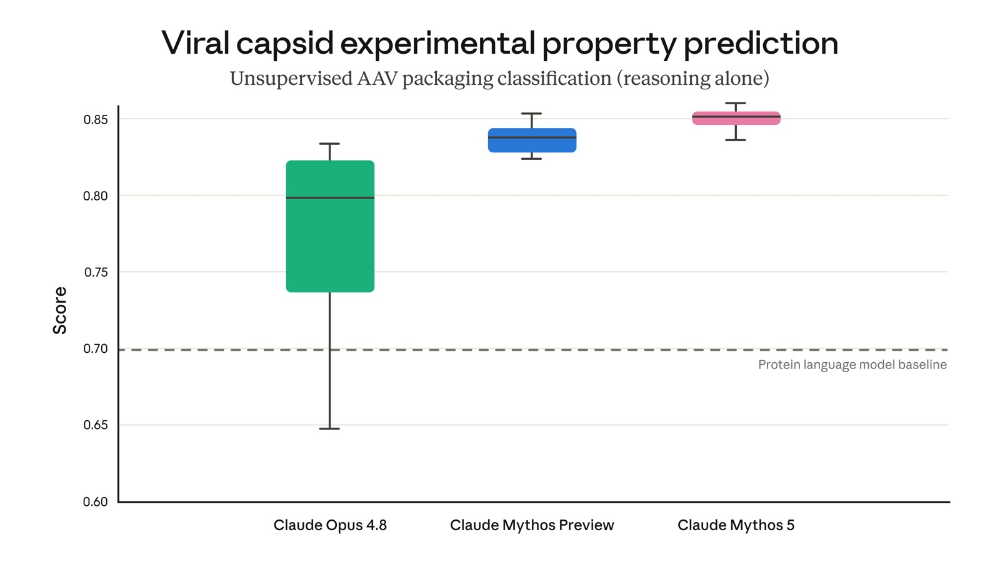

# 2026/06/10 · Claude Fable 5：最强的 Claude 开放了，但戴着镣铐

6 月 9 日，Anthropic 发布 Claude Fable 5，称它是公司至今向公众开放过的、能力最强的模型，在测试过的几乎所有能力榜单上都做到了当前最好。

发布的时机有点微妙。就在不久前，Anthropic 还公开警告 AI 进展太快、可能正在逼近「自我改进」的临界点，呼吁全球主要实验室一起建立某种「刹车机制」。这次它把手里最强的模型放了出来——代价是给它上了一道安全闸。

这次发布的主视觉——用一堆蝴蝶标本拼出数字「5」。Fable（寓言）这个名字，延续了 Claude 给模型起「文学体裁」名的传统。（图源：Anthropic 官方）

---

## 一、Fable 5 和 Mythos 5：同一个大脑，戴不戴镣铐

这次一口气发了两个模型：**Claude Fable 5** 和 **Claude Mythos 5**。它俩是同一个底座，区别只在戴不戴镣铐。

- **Mythos 5（神话）**：完整能力版，不加限制，但**不对外开放**——只给少数经过审查的合作机构（比如网络安全防御方、生物医药研究团队）使用。
- **Fable 5（寓言）**：在同一个底座上加了一套安全护栏，**这才是你我能用到的公开版**。

Claude 一直用「文学体裁」给模型档位命名，从轻量到旗舰大致是 Haiku（俳句）、Sonnet（十四行诗）、Opus（巨作），现在最顶上又加了 Fable（寓言）和 Mythos（神话）两档——名字越「宏大」，能力越强。Mythos 站在塔尖，Fable 是它戴好护栏后见公众的样子。

所以这里有个容易被忽略的事实：你能用到的「最强」（Fable 5），和真正存在的「最强」（Mythos 5），中间隔着一道闸。

---

## 二、有多强

每次新模型发布，第一张图永远是跑分对比表（benchmark，就是一组用来给 AI 能力打分的标准化考试）。

官方跑分总表，最左侧高亮列是 Mythos 5 / Fable 5。从编程、知识工作到空间推理、法律、生物，多数项目领先 Opus 4.8、GPT-5.5 和 Gemini 3.1 Pro。（图源：Anthropic 官方）

挑几个普通人也能看懂的：

- **编程（SWE-Bench Pro）**：80.3%，上一代旗舰 Opus 4.8 是 69.2%，GPT-5.5 是 58.6%。
- **知识工作（GDPval-AA）**：1932 分，高于 Opus 4.8（1890）、GPT-5.5（1769），把 Gemini 3.1 Pro（1314）拉得很远。
- **更难的编程题（FrontierCode）**：29.3%，而 Opus 4.8 只有 13.4%、GPT-5.5 只有 5.7%——题越硬，差距越大。

两项编程榜单。左边是常规难度（SWE-Bench Pro），右边是高难度子集（FrontierCode）——越往难处走，Fable（橙）和其它两个模型的差距越大。（图源：Anthropic 官方）

官方和早期试用方反馈最多的是两个能力：

一是**能自己干很久**。以前的 AI 是你问一句、它答一句；Fable 5 可以接一个大任务，自己拆解、动手、跑测试、验完再回来汇报，中间不太需要你盯着。官方举的例子：只靠屏幕截图，自己从头通关一遍《宝可梦》；在游戏《Factorio》里自主规划、建造整座工厂。换句话说，你交给它的不再是一个问题，而是一个目标。

二是**看图很准**。它能从一张网页截图反推出这个网页的源代码，能从复杂的科研图表里精确读出数字。官方称它是目前视觉理解最强的模型。

---

## 三、它凭什么敢公开

Fable 5 能公开，靠的是一道自动安全闸。

**回答之前，它先有一个「分类器」（相当于门口的安检员）判断你的问题属不属于高危领域。** 一旦命中下面几类，它就不让 Fable 5 亲自回答，而是把请求**降级转交给能力更弱、更安全的老型号 Opus 4.8** 来处理：

- 网络安全（尤其是怎么找漏洞、怎么发动攻击）
- 生物、化学（比如怎么制造毒素）
- 模型蒸馏（distillation，指竞争对手想套取这个模型的能力去训练自己的模型）

这种降级平均**只在不到 5% 的对话里触发**——95% 以上的正常使用，你用到的都是满血 Fable 5。

这道闸锁得很彻底。官方放出的一张对比图：

四项「进攻型网络安全」测试。无护栏的 Mythos 5（粉）成功率高到 83.8%、88.4%，戴了护栏的 Fable 5（橙）四项**全是 0.0%**——同一个大脑，一个能干，一个被彻底锁死。（图源：Anthropic 官方）

在网络攻击这件事上，Mythos 5 接近满分，Fable 5 被锁成了零分。Anthropic 把自己最危险的那部分能力亲手摁下去，才把模型交给公众。

护栏不是简单的关键词屏蔽。Anthropic 找了外部红队（red team，专门扮演攻击者来找系统漏洞的安全团队）做了上千小时测试，目标是确认没人能轻易「越狱」（jailbreak，用各种话术绕过 AI 的安全限制）。官方也坦承：想百分百堵死越狱大概不可能，能做到的是让每一次越狱都足够慢、足够贵，贵到还没被滥用就先被发现。

---

## 四、Mythos 曾经惊动过监管

Anthropic 把网络安全能力锁得这么狠，是有前情的。

更早的 Mythos 版本被披露具备**自动发现并利用软件漏洞**的能力——通俗讲，就是能像顶尖黑客一样，自己找出软件的安全弱点并加以攻击。这个消息当时在国际网络安全圈引起不小震动，据报道，连美国财政部长都为此召集华尔街大银行的 CEO，专门讨论 AI 带来的网络安全风险。

至于「更强会不会更失控」，官方给的数据是：Mythos 5 在「行为是否跑偏」的对齐测试里得分 2.06，和上一代 Opus 4.8（2.05）基本持平——能力大涨，但「听不听话」没变差。

「行为跑偏」测试，分数越低越安全。Mythos 5（粉）2.06，和 Opus 4.8（绿）2.05 几乎一样，都明显低于更早的 Sonnet 4.6（2.81）。（图源：Anthropic 官方）

---

## 五、最强，也最贵

Fable 5 的定价是**输入每百万 token 10 美元、输出每百万 token 50 美元**。

> token 可以粗略理解成 AI 处理文字的计量单位，大致对应字数——一百万 token 差不多是几十万字的量。「输入」是你发给它的内容，「输出」是它生成的回答，通常输出更贵。

这正好是上一代 Opus 4.8（输入 5 美元、输出 25 美元）的两倍。它还能自己干很久，干得越久烧的 token 越多，一个跑几小时的长任务单次账单可能相当可观。早期试用者的普遍建议是：用它干高价值的硬活，并且设好用量上限。

横轴是每个任务的平均花费（美元，对数刻度），纵轴是准确率。Fable 5（橙）整条曲线都压在 Opus 4.8（绿）和 GPT-5.5（灰）之上；把它的努力档位（从 low 到 max）调得越高，花钱越多，准确率也爬得越高。（图源：Anthropic 官方）

可用性有个时间窗：**6 月 9 日到 6 月 22 日，Pro、Max、Team 以及按席位计费的企业版用户可以免费用 Fable 5；6 月 23 日起转为消耗订阅额度。** API 用户从发布当天起按上面的价格付费。想免费体验的，趁这两周。

---

## 六、它还能做科研

这一代在科学研究上也有进展。官方披露，在蛋白质设计这类任务上，完整版 Mythos 5 让内部专家的效率提升了约 **10 倍**；在一项预测病毒衣壳（病毒外层的蛋白质外壳）实验性质的测试里，它的表现稳定超过了专门为蛋白质设计的传统模型。

一项病毒衣壳性质预测测试。Mythos 5（粉）不仅分数高，而且非常稳定（箱体很窄），明显高于灰色虚线代表的「传统蛋白质模型基线」。（图源：Anthropic 官方）

通用大模型正在「越界」，开始在专业科研里干过去要靠专用工具才能做的事。这也正是生物、化学被列进那道安全闸的原因——同一种能力，用来设计救命的药，和用来设计害人的毒，往往只隔一层窗户纸。

---

## 七、要不要用，怎么用

- **用 AI 写代码、跑长流程任务**：值得试，尤其趁 6 月 22 日前的免费窗口。它的长处不在「聊得好」，而在「能自己把一摊硬活干完」。但它贵，干高价值的活、设好用量上限。
- **主要做日常问答、写点东西**：不必急着上。它的能力是为「大任务」准备的，日常场景用 Opus 4.8 甚至更轻的型号，性价比更高，体验差别不大。
- **这次发布最该记住的**：不是「最强」两个字，而是那道闸——一家公司有能力造出连监管都紧张的模型，最后选择把最危险的部分主动锁到 0 分才放出来。真正完整、没戴镣铐的 Mythos 5，目前还只在少数机构手里。

---

## 扩展阅读

本文综合了 Anthropic 官方发布信息与以下中文作者的解读（推荐读原文）：

- [《刚刚，Anthropic 首个神话级 Claude 5 正式解禁！》](https://mp.weixin.qq.com/s/jqBsN_2UDie47GVQj8L5MQ) · **新智元**（微信公众号）
- [《Anthropic 最强模型 Fable 5 来了》](https://mp.weixin.qq.com/s/sSxDl4UWI5Q5RYm4YQI0KQ) · **AI小范儿**（微信公众号）
- [《Claude Fable 5 发布，最强的模型，最贵的价格，最大的野心》](https://mp.weixin.qq.com/s/lV_160sgGIahflX64cXCKg) · **AGENT橘**（微信公众号）
- [Claude Fable 5 and Claude Mythos 5（官方发布稿）](https://www.anthropic.com/news/claude-fable-5-mythos-5) · **Anthropic 官方**
