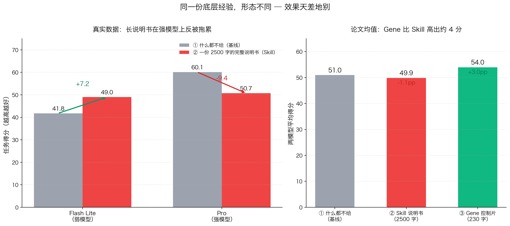
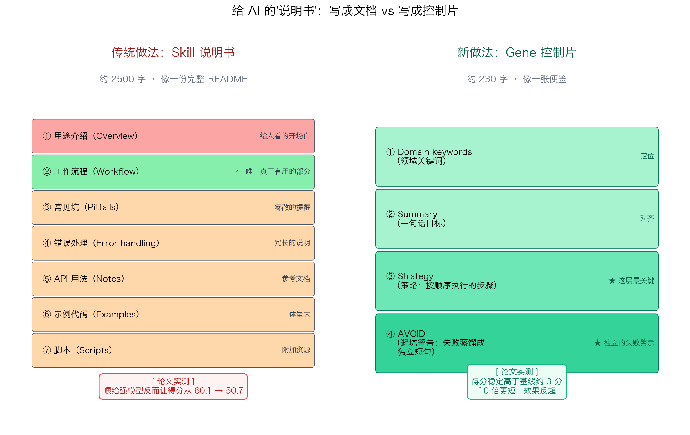

# 给 AI 写一份超详细的说明书，反而让它变笨了？

> 🧠 **所属专区**：AI 前沿探讨
> 📖 **阅读时长**：约 8 分钟
> 🎯 **面向读者**：不需要技术背景，读完你能给同事讲清楚这件事
> 📚 **原文引用**：《你写的 Skill，正在拖慢模型？策略式 Gene 才是正确答案》· 机器之心（2026-04-21）

---

## 一、一个很多人都踩过的坑

想象一下：你要把一项工作交给一位新同事。

你给 ta 写了一份**超详细的工作手册**——项目背景、每一步流程、常见的坑、错误处理、工具使用、案例参考、注意事项……应有尽有。

你以为 ta 从此就能完美接手了。可下一次同类任务来了，ta 还是在同一个地方犯同样的错。

把"新同事"换成 **AI**（你平时用的 Claude、ChatGPT、豆包、Kimi 都算），这就是 AI 圈近几年反复出现的一种"玄学"：

> **你把文档写得越来越详细，AI 却还是在同一个地方犯错。**

最近，一篇来自 **清华大学 × EvoMap 团队**的论文给这个现象找了个出人意料的答案：

> **我们给 AI 写的说明书，本身可能就是问题所在。**

更准确地说——问题不在"**说明书长不长**"，而在"**说明书长什么形状**"。

---

## 二、一个反直觉的实验

研究团队做了一组非常干净的对比实验。

**同一份底层经验**（关于如何写科学计算代码），他们打成了两种不同的"形态"喂给 AI：

| 形态 | 长度 | 内容 |
|---|---|---|
| ① 常规说明书（论文称 **Skill**） | ~2500 字 | 用途介绍 + 完整工作流 + 常见坑 + 错误处理 + 工具用法 + 示例 + 脚本…… 像一份 README |
| ② 精简控制片（论文称 **Gene**） | ~230 字 | 几个关键词 + 一句话目标 + 一组按顺序的步骤 + 一张避坑清单 |

**底层知识完全一样，只是包装方式不同**，然后用两个 AI 模型（一个弱的 Flash Lite、一个强的 Pro，都是 Google Gemini 系列）跑同一批任务。

结果——反直觉得令人不适：

三个关键事实：

1. **在弱模型 Flash 上**：给那份 2500 字的说明书确实有帮助（41.8 → 49.0，涨 7.2 分）。跟我们直觉一致。
2. **但在强模型 Pro 上**：同样那份说明书，**得分从 60.1 掉到了 50.7，比什么都不给还差 9.4 分**。
3. **换成 230 字的 Gene 控制片**：不论强弱模型，**稳定高于基线约 3 分**。

同一份知识，形态改了一下，结果**完全颠倒**。

这个发现其实很扎心。作者给出了一句金句：

> **"给人看的东西塞进模型的执行预算，反而会成为控制噪声。"**

翻译成大白话：**AI 读那份 2500 字的说明书时，不是在"学习"，而是在有限的注意力里挑"下一步该做什么"**。那些给人类工程师看的背景介绍、用途说明、冗长的错误处理段落，对 AI 来说全是**干扰**——把真正有用的指令稀释掉了。

---

## 三、说明书 vs 便签：结构差别在哪

让我们直观看一下这两种"说明书"的结构：

**左边的 Skill 说明书**：
- 7 个章节，信息齐全
- 从**人类读者**角度看非常完整
- 但论文的拆解实验发现——**只有"工作流程（Workflow）"这一段真正在起作用**，其他 6 段都在拖后腿；最讽刺的是"用途介绍（Overview）"是全文**最大的负贡献段落**。

**右边的 Gene 控制片**：
- 4 个字段，极度精简
- 最关键的是 **Strategy（策略）** 和 **AVOID（避坑）** 这两层

论文做过一个"拆解实验"（学术里叫消融实验，逐层去掉字段看效果）：

- 只有 `keywords + summary`（关键词 + 一句话摘要）——效果跟什么都不给一样
- **加上 `Strategy` 这一层——效果立刻起飞**

这是 Gene 最值得记的一点：

> **同样的字数，组织成"摘要"没用，组织成"策略"才有用。**

决定 AI 行为的不是**字数**，而是**"控制密度"**——这段文字能不能告诉 AI"下一步该做什么、什么不能做"。

---

## 四、最反直觉的发现：失败经验的最佳形态是"独立的避坑警告"

所有用 AI 做事的人都遇到过这个问题：AI 上次犯的错，这次怎么避免再犯？

有几种常见做法：

- 把完整的错误日志喂给它？
- 写一段"反思总结"？
- 追加到原来的说明书里？

研究团队把这几种都试了一遍，结果——**都不如最简单的做法**。

**最有效的形态**，叫 **failure warnings only**（"只要避坑警告"）——把每次失败蒸馏成一句独立的"AVOID xxx"（避免做 xxx），就像这样：

> AVOID 把 min_distance 当成波长值传给 find_peaks，要先转成采样点单位
>
> AVOID 把 peak_widths 的原始输出直接当 FWHM 上报，要先换回波长单位

（不用看懂内容，看形式就好：**一句一条，不解释、不连贯、不包装**。）

更惊人的是：**这种"只要避坑警告"的形态，比"策略 + 详细失败记录"的混合形态得分还高**。

也就是说：

> **失败经验的积累应该是"选择性压缩"，而不是"加法式堆叠"。**

这条其实对人类团队也成立——当新同事连续踩坑时，给 ta 一份"**别再做这三件事**"的清单，比给 ta 一份"全面反思周报"有用得多。

---

## 五、这对我们普通人有什么用？

你可能会想：**我又不是 AI 研究员，这论文看完有什么用？**

其实很有。三件你立刻可以想的事：

### 用法 1 — 你给 AI 写 prompt 时可以换个思路

很多人用 AI 时的习惯，是写一大段"详尽的背景 + 任务要求 + 希望它怎么做"。下次可以试试这样组织：

✅ **保留**：
- 任务目标（一句话）
- 执行步骤（编号，按顺序）
- **AVOID 清单**（哪些坑不要踩）

❌ **去掉**：
- 背景介绍（"这个项目是关于……"）
- 用途说明（"你的任务是……"）
- 为什么要这么做（原因和动机）
- 你自己的思考过程

这就是 Gene 思路的日常版。**你给的指令可能字数少了一半，但 AI 执行质量反而上去了**。

### 用法 2 — 团队写 SOP 时想一下"给谁看"

我们给人类同事写 SOP（标准操作流程）时常常用"完整主义"：背景、目的、每个步骤、每个例外、所有附录。这**对人类是安全感**。

但如果你的 SOP 未来要让 AI 来跑自动化呢？那就要重新组织：**一句话目标 + 编号步骤 + 避坑清单**——这就是给机器用的"有用结构"。

未来可能一份 SOP 要**分两版写**：一版给人看（完整的），一版给 AI 用（精简的）。

### 用法 3 — 一个可以记很久的判断框架

这篇论文指出了一对很重要的区分：

| 维度 | 代表 | 特点 |
|---|---|---|
| **能力指标** | "AI 记得多少" / 跑分 / 准确率 | 容易测，但**不稀缺** |
| **智能特质** | "AI 该想到的时候能想到" | 难测，但**真正值钱** |

**"AI 能记多少"、"AI 跑分多高"是能力指标**。
**"AI 能不能从零散线索里拼出该采取的行动"是智能特质**。

真正让 AI 变强的，不是前者，是后者。

这个框架也可以迁移到人本身：
- 我们学 AI 时，知道多少名词（工具名 / 概念名）是"能力指标"
- 遇到新工具时能不能快速上手、能不能判断好坏、能不能和已有经验迁移——是"智能特质"

---

## 六、一句话收尾

过去几年，AI 圈的习惯是——

> "让 AI 变得更好 = 让它**看到更多内容**（更大模型 / 更长上下文 / 更详细文档 / 更复杂知识库）"

这篇论文提出了反方向：

> "让 AI 变得更好 = 让它**在对的时刻看到对的控制信号**（把经验蒸馏成紧凑的、可直接执行的对象）"

这两条路未来大概率都会走。但第二条，**在过去几乎被整个 AI 圈忽视了**。

**给 AI 的说明书要写得更少、更精、更像便签**——这可能是一个即将普及的共识。

也是我们这些日常用 AI 的人，立刻可以用起来的一条经验。

---

## 扩展阅读

本文参考了以下原作者的文章（推荐读原文）：

- 《你写的 Skill，正在拖慢模型？策略式 Gene 才是正确答案》 · **机器之心**（微信公众号）· [点击阅读原文](https://mp.weixin.qq.com/s/NCb4489oBtPCa-3xgxAicQ)
- 论文原文：《From Procedural Skills to Strategy Genes: Towards Experience-Driven Test-Time Evolution》 · arXiv: 2604.15097
- EvoMap 团队的开源进化引擎 Evolver：github.com/EvoMap/evolver

---

*本文由 William × Claude 共同撰写。如有任何不清楚或需要修改的地方，欢迎在飞书文档上直接批注。*
