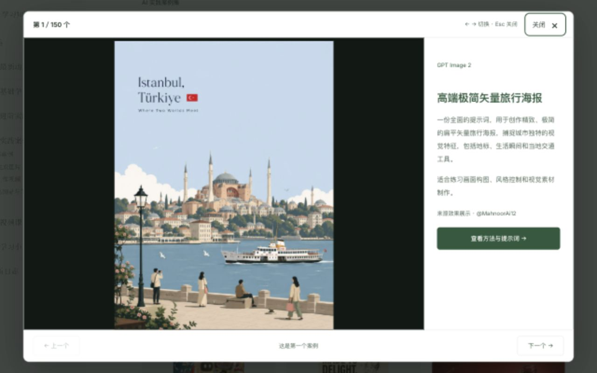
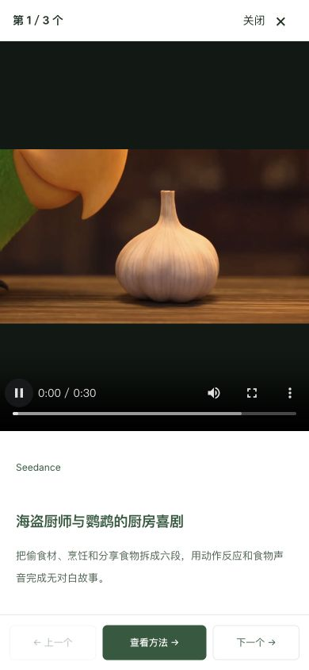

# 测试报告 · 案例库连续浏览交互 · 2026-10-06

## 测试环境
- 本地 VitePress 生产构建、预览：`http://localhost:5178/cases/`。
- Codex 内置浏览器；桌面 1280 × 800、手机 390 × 844 视口。
- `npm run docs:build`、`node --test tests/case-browsing.test.mjs`、`node scripts/check-practice-cases.mjs 400`、`git diff --check` 均通过。
- 2026-10-06 用户确认发布；本报告记录发布前本地验收结果。全库仍为 400 个，案例正文、完整提示词与来源不变。

## 本次行为
点击封面打开大图/视频预览；在当前分类与搜索结果中连续切换，显示当前序号、总数和首尾边界。电脑支持左右方向键、Esc，播放器获得焦点时方向键继续用于视频操作。手机全屏展示，底部固定前后切换与查看方法。标题和卡片底部链接直接进入方法页。

详情顶部可返回预览、返回列表或切换前后案例，导航始终使用同一来源列表。位置按分类及搜索分别保存，含滚动位置、已加载数量与原封面按钮。直接访问详情默认本分类，避免误读之前的无关搜索记录。

预览只播放当前视频，切换、关闭或进入方法页时停止当前播放；新视频由用户主动播放。相邻预加载仅使用本地封面。图片加载时保留封面；失败时有重试和继续浏览入口。

## 测试用例

| # | 测试场景 | 操作步骤 | 预期结果 | 实际结果 | 状态 |
|---|---------|---------|---------|---------|------|
| 1 | 全量搜索翻看 | 视频区搜索“产品”，从首条连续切换 | 只经过匹配结果，超过首屏也可翻 | 共 19 条，成功到第 13 条与第 19 条；列表初始仅 12 条 | 通过 |
| 2 | 首尾边界 | 查看首条、末条 | 对应方向禁用且不循环 | 第 1 条禁用上一条，第 19 条禁用下一条 | 通过 |
| 3 | 加载数量与位置恢复 | 加载全部 19 条，在第 12 条封面打开；切换、阅读方法、返回预览，再后退 | 恢复搜索、原位置和加载数量 | q=产品，已显示 19/19，恢复 y=1388，焦点回到原封面 | 通过 |
| 4 | 方法页连续切换 | 预览第 13 条进入方法，再切换第 14 条并返回预览 | 同一搜索结果、同一当前位置 | 方法与预览均显示第 14/19 条，from 保留原列表 | 通过 |
| 5 | 后退与 Esc | 预览进入方法，浏览器后退，再按 Esc | 回到预览，然后关闭并恢复列表 | 弹窗关闭，body 锁定解除，恢复 y=1388 | 通过 |
| 6 | 视频实际播放 | 播放海盗厨师样例，再切换 | 可播放且下一条不自动播放 | readyState=4，时长 30.272 秒；切换后仅 1 个视频、播放数为 0 | 通过 |
| 7 | 播放器键盘 | 视频获得焦点后按右方向键 | 视频操作不触发换案例 | 播放进度变化，案例仍是第 1/3 条 | 通过 |
| 8 | 图片预览 | 打开旅行海报 | 按原图比例展示，不出现视频播放器 | 原图加载为 900 × 1200，播放器数量为 0 | 通过 |
| 9 | 媒体失败 | 临时本地验证页使用不存在视频地址，点击播放，再重试和切换 | 封面、提示、重试和切换仍可用 | 失败提示与封面出现，重试重新创建播放器，下一条正常 | 通过 |
| 10 | 手机预览 | 390 × 844 下查看预览、进入方法、返回并关闭 | 操作可见、无横向溢出 | 底部操作区域在 y=774～844；预览宽度 390，方法页内容宽度与滚动宽度均 386 | 通过 |
| 11 | 深色模式 | 切换深色后打开预览 | 文字和按钮可辨 | 页面与预览使用主题颜色，操作可辨；已恢复浅色 | 通过 |
| 12 | 路径与存储隔离 | 6 项自动测试 | 保留中文搜索，拒绝错误来源，按分类及搜索隔离状态 | 6/6 通过，含真实 400 条元数据检查 | 通过 |
| 13 | 内容回归 | 完整性与资源检查 | 原内容、提示词和作者出处保留 | 400 个案例检查全部通过 | 通过 |

## 发现的问题与修复
- 原站全局链接颜色覆盖预览主按钮，已增加专门样式保证按钮文字可读。
- 从方法页或直接链接打开预览时，原浏览器后退会离开列表，已在预览下保留列表历史项，后退先关闭预览。
- VitePress 导航会覆盖预览历史标记。预览进入方法采用普通页面导航，保持原预览历史；返回位置同时由分列表的状态记录保证。
- 图片远程加载期间原本为空白，已补本地封面占位及加载状态。
- 临时媒体失败验证页已删除；最终构建不含该页面。

## 遗留风险
- 手机布局使用浏览器视口模拟，尚未在真实手机、微信浏览器或线上发布环境验证。
- 视频和原效果图依赖来源地址及网络；当前已有失效提示、封面回退、重试和继续切换入口。

## 验收清单（给 William）
- [ ] 连续看几个视频，切换和关闭符合预期。
- [ ] 搜索一个用途，进入方法页后返回仍在同一批结果与原列表位置。
- [ ] 手机底部按钮够清楚、够容易点击。
- [ ] 确认本地体验后再发布。

## 预览截图

