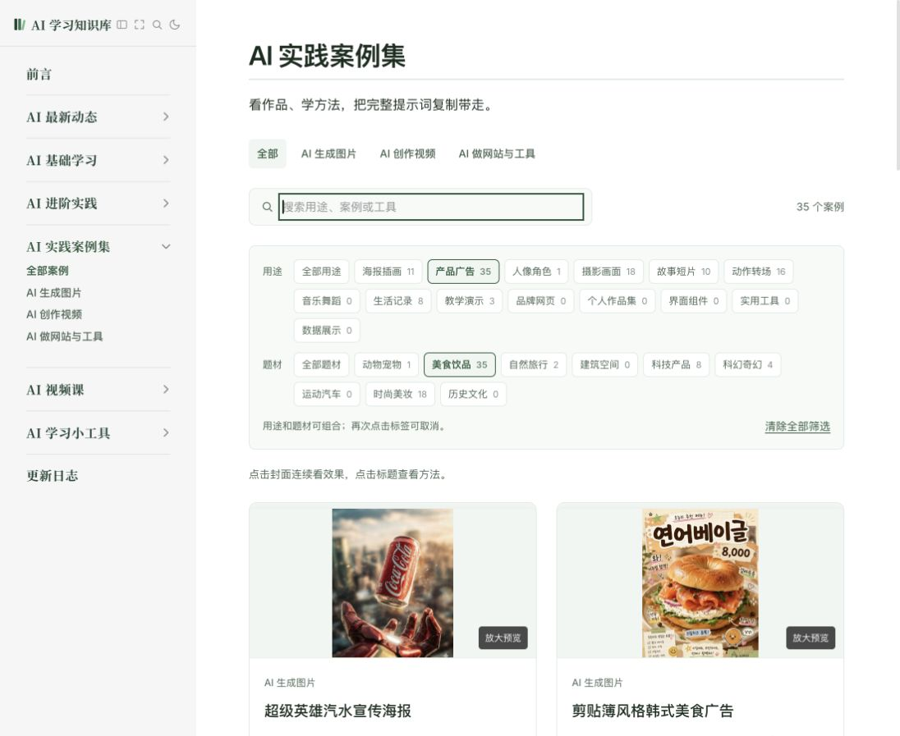

# 测试报告 · 案例标签筛选 · 2026-10-09

550 个案例增加了 14 个用途标签和 9 个题材标签。桌面点击标签，手机用两个紧凑的选择框；标签可与分类和关键词组合，连续浏览和返回时保留筛选条件。本报告记录已完成的本地验收；2026-10-10 用户确认与新增 150 个案例一并发布 v1.75。

## 测试环境

- 桌面端：Codex 内置 Chromium 浏览器；默认桌面视口及 1100px 宽度。
- 移动端：同一浏览器模拟 390 × 844 视口；没有使用真机微信或 Safari。
- 正式构建预览：<http://127.0.0.1:5178/cases/?purpose=product-ad&topic=food>。
- `npm run docs:build` 成功：52 项自动测试通过，550 个案例及 767 个 HTML 页面的链接、资源和锚点检查通过。
- 标签正本为独立 `case-tags.json`，按 slug 合入展示数据；没有改作者原文、署名、来源、媒体、原文指纹或选择顺序。

## 测试用例

| # | 测试场景 | 操作步骤 | 预期结果 | 实际结果 | 状态 |
| --- | --- | --- | --- | --- | --- |
| 1 | 全库标签覆盖 | 对照 550 条选择清单与生成索引 | 每条至少有一个合法用途，标签进入实际展示数据 | 全库完整覆盖，全部 ID 合法，无重复；189 条未强行填题材 | ✅ 通过 |
| 2 | 两组组合筛选 | 选择产品广告、美食饮品 | 只显示同时命中的案例 | 正式构建预览显示 35 条，首批均为食品与饮料广告等对应作品 | ✅ 通过 |
| 3 | 标签加关键词 | 在上述组合搜索“饮料” | 进一步缩小结果 | 显示 4 条，分别为涂鸦饮料、清晨能量饮料、芒果汁、饮料幻想广告 | ✅ 通过 |
| 4 | 标签加分类 | 在手机点击图片分类入口 | 保留已有标签，进一步限定图片 | URL 与选择框保留两标签；分类交集由统一筛选函数验证 | ✅ 通过 |
| 5 | 中文标签搜索 | 将标签名与作者、工具名组合查询 | 标签名与已有文字字段共同匹配 | 针对性测试通过，多词按交集匹配 | ✅ 通过 |
| 6 | 刷新与深链接 | 刷新两标签加搜索 URL | 恢复完整筛选 | 两组标签与关键词恢复，结果保持 4 条 | ✅ 通过 |
| 7 | 详情连续导航 | 进入饮料案例详情 | 前后范围限定于四个匹配案例 | 显示第 1/4 个，首项没有上一条，下一条为清晨能量饮料 | ✅ 通过 |
| 8 | 返回预览与列表 | 详情返回预览、下一条、关闭 | 保留 q、purpose、topic 和目标 | 预览仅在四条内切换，关闭回到原筛选列表；完整集合超首屏由自动测试验证 | ✅ 通过 |
| 9 | 标签入口 | 点击卡片标签与详情“美食饮品”标签 | 可找到同类案例 | 卡片入口保持当前组合且定位到筛选；详情标签进入全部美食饮品的 65 条结果 | ✅ 通过 |
| 10 | 零结果与恢复 | 选择不匹配组合，并清除 | 保留所选条件，提供恢复入口 | 显示 0 条与清除提示；清空后恢复 550，键盘焦点回到搜索框 | ✅ 通过 |
| 11 | 无效深链 | 输入不存在的用途 ID 与预览标识 | 去除无效值，保留有效题材 | URL 规范化为 `?topic=food`，不打开无效预览 | ✅ 通过 |
| 12 | 保存位置隔离 | 比较标签组合及不同参数顺序 | 相同组合共用状态，不同组合分开 | 自动测试验证两维、分类、关键词的状态隔离与路径规范化 | ✅ 通过 |
| 13 | 手机与键盘 | 手机用两组选择框，桌面用 Enter 选择标签 | 能正常筛选，不造成整页横向溢出 | 390px 视口下页面宽 386px，选择值与 URL 一致 | ✅ 通过 |
| 14 | 无效维护数据 | 注入缺项、未知 ID、重复 ID、孤立 slug 到内存样本 | 生成前校验拒绝数据 | 四种错误均被拒绝，未写入正式数据 | ✅ 通过 |
| 15 | 来源与范围回归 | 与固定发布基线比较并检查受保护配置 | 旧内容和原文不变，无无关改动 | 旧 400 条完整数据与顺序不变；新增仍为 75/45/30；受保护配置和素材库无修改 | ✅ 通过 |
| 16 | 构建与资源 | 完整构建、案例与站内链接检查 | 无失败 | 52 项测试、550 条案例、767 页检查通过；生产预览无页面错误 | ✅ 通过 |

## 发现的问题

- 关键词草稿容易把“数字员工”误当数据展示、把手机模型误当科技题材、把复古风格误当历史文化。三组案例已逐条复核，修正这些边界。
- 数据面板、角色选择界面也可能以视频展示，因此不按媒体类型强制用途标签；静态动作参考图也不冒充故事成片。
- 手机直接展开全部标签会挤占案例展示空间，已改成两个紧凑选择框；桌面保留可点击标签与匹配数量。
- 清除按钮消失会丢失键盘焦点，已改成清空后回到搜索框。
- 构建仍有已有的部分打包文件超过 500 kB 提示，构建成功。

## 遗留风险

- 标签是本站的编辑归类，帮助查找，不是作者原标签、生成效果评级或复现证明。题材不明确时留空，用途仍可筛选。
- 每组选一个条件，组间取交集；单个案例可以属于多个标签。卡片最多显示三个代表标签，详情可查看全部。
- 真机微信、Safari 与手机触摸体验仍需实际设备抽查。
- 本报告中的通过结果来自本地生产构建预览；正式部署结果与线上页面由发布流程另行核对。

## 验收清单

- [ ] 用途和题材的名称容易理解，实际结果符合查找意图。
- [ ] 试用产品广告＋美食饮品、海报插画＋自然旅行等组合。
- [ ] 搜索、连续预览、详情前后与返回列表符合预期。
- [ ] 在实际手机浏览器中抽查选择框与卡片标签。
- [x] 2026-10-10 用户确认与新增 150 个案例一并发布 v1.75。

