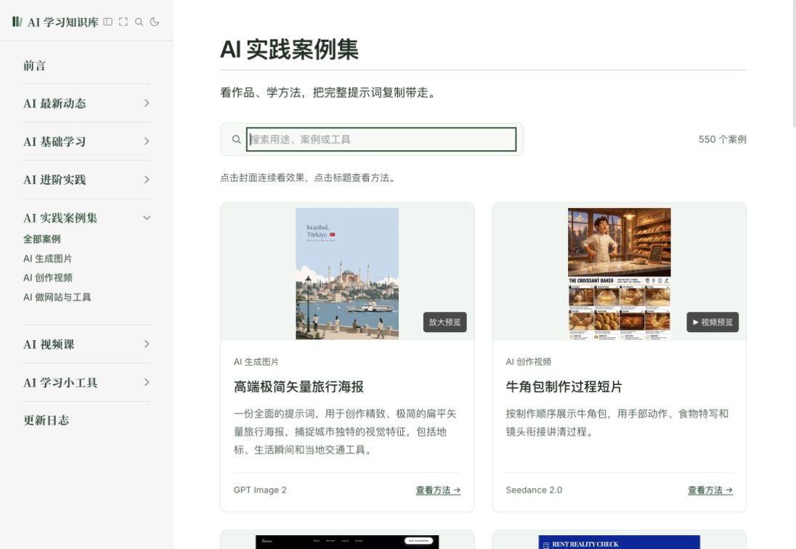

# 测试报告 · AI 实践案例集新增 150 个 · 2026-10-09

本批新增 150 个有来源的案例，累计 550 个；本地开发与验收完成，2026-10-10 用户确认随 v1.75 发布。旧 400 条原始数据、正文、顺序和封面保持；后续标签功能只在详情页增加导航，详见标签测试报告。

本报告记录新增 150 条完成时的结果。随后增加了全库标签导航，生成页面因此发生导航差异；来源正文、顺序和封面仍保留，最新验证见 [标签测试报告](./case-tags-test-report.md)。

| 分类 | 原有 | 本批新增 | 累计 |
| --- | ---: | ---: | ---: |
| AI 生成图片 | 150 | 75 | 225 |
| AI 创作视频 | 190 | 45 | 235 |
| AI 做网站与工具 | 60 | 30 | 90 |
| 合计 | 400 | 150 | 550 |

## 测试环境

- 桌面端：Codex 内置 Chromium 浏览器，生产构建预览；另外检查 1100px 宽度布局。
- 移动端：同一浏览器模拟 390 × 844 的视口；没有使用真实手机、微信或 Safari。
- 本地预览：<http://127.0.0.1:5178/cases/>。
- 本地构建：`npm run docs:build` 成功，44 项自动测试通过；550 个案例及 767 个 HTML 页面的链接和资源检查通过。
- 增量比较基线：已发布完整 commit `92a76b0b6f82bb1e76e50ddfa66a42731b66983b`（v1.74）。

## 测试用例

| # | 测试场景 | 操作步骤 | 预期结果 | 实际结果 | 状态 |
| --- | --- | --- | --- | --- | --- |
| 1 | 数量与分类 | 校验选择清单、正文并访问三个分类 | 新增 75/45/30，总数 550 | 页面分别显示 225/235/90，总页显示 550 | ✅ 通过 |
| 2 | 保留已有内容 | 与固定已发布基线比较旧 400 条数据及文件 | 内容、顺序、页面、封面不变 | 旧完整数据和清单相同；旧 400 个页面和 400 张封面逐字节相同 | ✅ 通过 |
| 3 | 来源与去重 | 比较实时详情、作者、来源、媒体和原文指纹 | 150 条均可追溯，无重复 | 标识和规范化原文均无重复；150 条与最终来源快照一致 | ✅ 通过 |
| 4 | 逐条内容审阅 | 阅读新增原文、译文、步骤和练习 | 教学建议对应具体作品，明确与原文区别 | 150 条有独立学习要点和练习，来源原文保留；均显示本站未实测生成效果 | ✅ 通过 |
| 5 | 搜索新增案例 | 搜索“多场景 拼贴” | 找到新收录的拼贴案例 | 命中一条新案例，可打开详情 | ✅ 通过 |
| 6 | 全量分页 | 在全部案例页点击“再看 12 个案例” | 从 12 条增加至 24 条 | 显示“已显示 24 / 550 个案例” | ✅ 通过 |
| 7 | 中文与原文复制 | 在新拼贴案例切换语言并复制；复制 F1 长中文内容 | 复制全文，不仅是折叠区域 | 剪贴板逐字等于对应完整提示词；F1 中文复制长度 8929 字符 | ✅ 通过 |
| 8 | 下载完整笔记 | 下载新拼贴案例，读取实际下载文件 | 包含原文、中文、来源及教学说明 | 下载文件含标题、准备、步骤、学习要点、练习、完整中外文与来源 | ✅ 通过 |
| 9 | 连续预览与返回 | 从搜索结果进入详情，再返回预览并关闭 | 保留过滤条件与原卡片位置 | 预览显示 1/1、边界按钮禁用，关闭后恢复原卡片焦点 | ✅ 通过 |
| 10 | 新视频播放 | 打开麻婆豆腐动画案例并实际播放 | 来源视频能够播放完成 | 播放到 15.125 秒末尾，媒体错误为空、readyState 为 4 | ✅ 通过 |
| 11 | 视频媒体可读取 | 检查新增 45 个视频的媒体信息 | 能读取时长、画幅等媒体信息 | 45/45 可读取；不代表逐条完整解码或生成复现 | ✅ 通过 |
| 12 | 新增封面 | 检查 150 张联系表，单独复核含糊画面 | 封面与案例一致、资源齐全 | 150 张 JPEG 齐全，构建产物包含对应文件；新增约 5.98 MiB | ✅ 通过 |
| 13 | 手机宽度排版 | 检查总列表、新拼贴案例及 F1 长代码案例 | 正文和列表不造成整页横向溢出 | 390px 视口下页面宽度 386px，新图片无加载失败 | ✅ 通过 |
| 14 | 构建与资源 | 执行完整构建及显式 550 条检查 | 无测试、构建、资源错误 | 44 项测试通过；550 条案例和 767 个 HTML 页检查通过 | ✅ 通过 |
| 15 | 范围控制 | 核对受保护配置和素材库差异 | 无无关改动 | base/CNAME/Actions、kb-articles 无改动，差异空白检查通过 | ✅ 通过 |

## 发现的问题

- 人工审阅排除了 28 个候选，包括截断代码、缺少后半段分镜、失效详情及分类不符内容；没有用补写填充作者缺失原文。
- 两条来源缺少真实的完整中文译文：F1 网站案例与麻婆豆腐动画。已完整翻译，代码、地址、数值和指定文字保留。后者虽然接口标注 `zh-CN`，正文实际为日文，已按实际正文处理。
- 其余来源译文同样核对时间、画面条件、品牌和台词；共 124 条新增案例使用完整中文编辑覆盖，其余沿用核对后的来源中文正文。
- 40 张新列表封面含大段提示词文字，已裁去文字区；3 张视频封面改用第 5 秒或 7.5 秒的清晰画面。仅调整本地列表封面，来源效果媒体保持。
- 来源 F1 提示词有一条带 `[已省略]` 的赛车图片地址，已在准备事项及翻译说明中标出，需要使用者自行补全素材，没有编造地址。个别来源参数、时长或流程矛盾也就近说明。
- 构建仍提示部分打包文件超过 500 kB；这是已有提示，本批构建成功。

## 遗留风险

- 所有作品均为来源作者的展示，本批没有调用付费生成工具，也没有逐个复现生成结果；本站操作步骤和练习是学习建议。
- 远程图片和视频未来可能失效。列表封面已本地保存，原效果媒体仍按需从来源加载。
- 新增 45 个视频均已验证媒体信息可读取；仅对代表性案例实际播放，未对所有视频做完整解码或逐帧验收。
- 真机微信、Safari、真实手机布局需要设备验收。本地预览不会把使用动作发送到正式站点统计。
- 本报告记录本地验收；正式部署结果、线上案例总数与代表性新增详情由发布流程另行核对。

## 来源与维护记录

- 来源：[Goodcase](https://goodcase.ai/)，每个案例另保留作者原始出处和 Goodcase 详情链接。
- 来源目录快照为 1716 条；本批 150 条详情均重新请求，逐条记录抓取时间和原文指纹，未声称历史目录全部重新采集。
- 最终来源、排除原因和分组审阅记录保存在忽略缓存 `docs/.vitepress/cache/goodcase/batch550/`；维护流程见 [案例维护说明](./practice-cases-maintenance.md)。
- 对来源中写成 `-ar` 的单张图片提示词，中文版本按 [Midjourney 官方比例参数说明](https://docs.midjourney.com/hc/en-us/articles/31894244298125-Aspect-Ratio) 注明规范形式为 `--ar`，作者原文保持。
- 两份更新日志与项目状态已同步至 2026-10-10 的 v1.75 发布记录。

## 验收清单

- [ ] 新增图片、视频和网站案例的选题有用。
- [ ] 中文解释、练习和作者原文的区别清楚。
- [ ] 桌面端阅读、复制、下载和连续预览符合预期。
- [ ] 在实际使用的手机浏览器中抽查。
- [x] 2026-10-10 用户确认发布 v1.75；发布流程核对线上总数与代表性新增详情。

